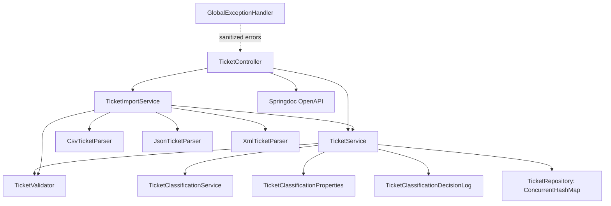
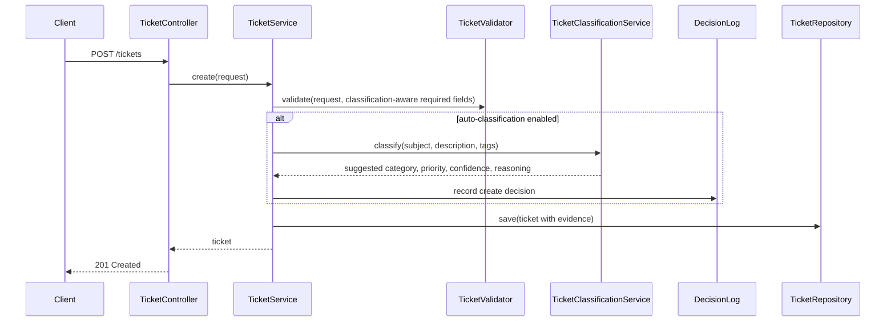
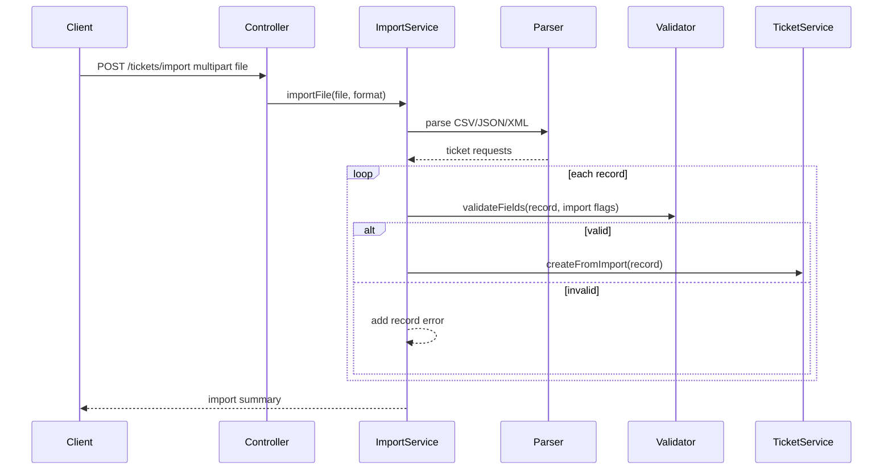
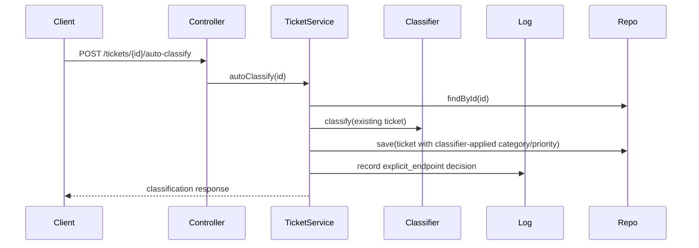

# Architecture

## Design Summary

Homework 2 is a single Spring Boot API with in-memory ticket storage. Task 1 provides CRUD, filtering, validation, CSV/JSON/XML import, and Swagger UI. Task 2 adds deterministic rule-based classification for category and priority, plus stored evidence and an in-memory decision log.

## Components

## Create And Classify Flow

## Import Flow

## Explicit Classification Flow

## Design Decisions

- **Rule-based classification:** Keeps Task 2 deterministic, transparent, and easy to test without external model credentials or nondeterministic responses.
- **Manual override with stored suggestion:** Existing Task 1 clients can keep sending category/priority; the API records the classifier suggestion for auditability.
- **Feature flags:** Create and import classification can be disabled independently, and manual override policy is separated by flow.
- **In-memory decision log:** Satisfies Task 2 decision logging for local homework scope without adding persistence.
- **Server-managed evidence:** Classification confidence, reasoning, keywords, suggestions, and timestamps are written by the server.

## Security Considerations

- Error responses are sanitized and do not expose stack traces.
- Upload size is capped at 5 MB in `application.properties`.
- Input is validated before storage.
- Classification is local string matching; ticket content is not sent to external services.
- No authentication is implemented because it is outside the current homework scope.

## Performance Considerations

- `ConcurrentHashMap` supports safe local concurrent access for this API-only implementation.
- Classification is linear text matching over a small keyword set and adds negligible overhead for homework sample sizes.
- Import parsing and classification are in-memory and suitable for the provided 50/20/30-record samples plus classification demo data.

## Known Limitations

- Data and classification logs are lost when the process stops.
- No database, authentication, pagination, or external model integration is included.
- Rule-based matching is explainable but less flexible than an LLM or hybrid classifier for ambiguous real-world tickets.
