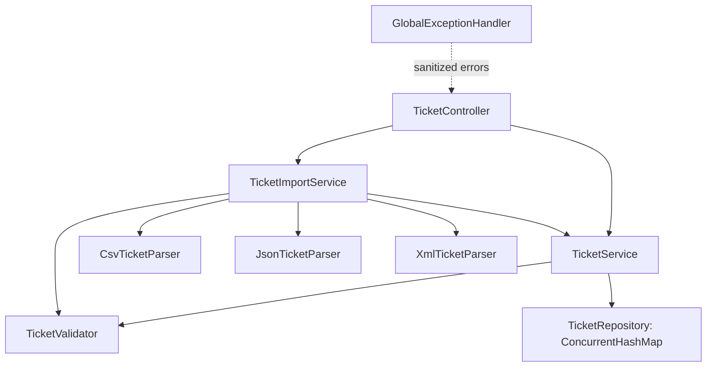
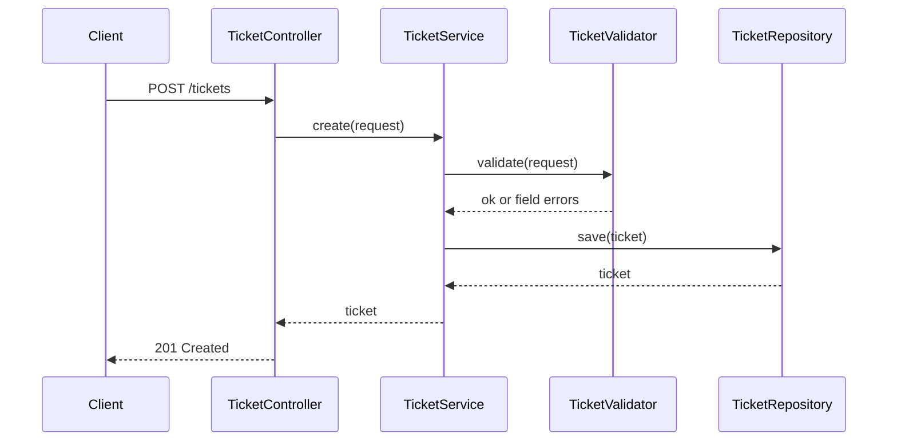
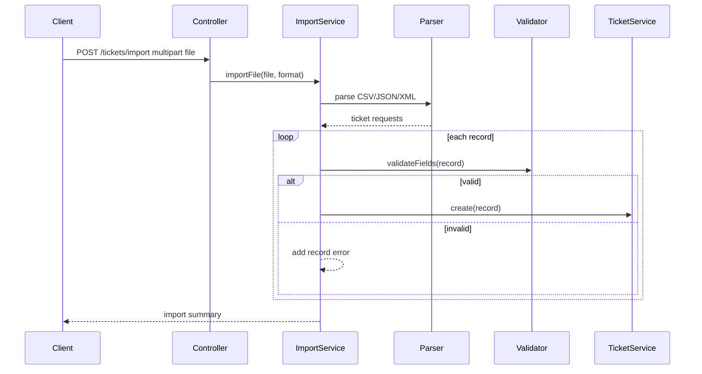

# Architecture

## Design Summary

Homework 2 Task 1 is a single Spring Boot API. It keeps data in memory to focus on API behavior, validation, import parsing, tests, and documentation. The design mirrors Homework 1's simple controller-service-repository style while adding import-specific parser components.

## Components

## Create Ticket Flow

## Import Flow

## Design Decisions

- **In-memory storage:** Keeps Task 1 focused and avoids database setup before the assignment asks for persistence.
- **Manual validation service:** Produces consistent field-level error responses for JSON requests and imported records.
- **Multipart imports:** Matches real file-upload usage and keeps sample data reusable in Postman.
- **Partial import success:** Valid records are saved even when other records fail validation.
- **Server-managed timestamps:** Clients cannot choose `created_at` or `updated_at`; terminal statuses get `resolved_at` automatically when omitted.

## Security Considerations

- Error responses are sanitized and do not expose stack traces.
- Upload size is capped at 5 MB in `application.properties`.
- Input is validated before storage.
- No authentication is implemented because it is outside Task 1 scope.

## Performance Considerations

- `ConcurrentHashMap` supports safe local concurrent access for this API-only implementation.
- Import parsing is in-memory and suitable for homework sample sizes.
- Performance test covers 50 CSV, 20 JSON, and 30 XML record imports within a five-second threshold.

## Known Limitations

- Data is lost when the process stops.
- Auto-classification, confidence scores, and decision logging are reserved for Task 2.
- No pagination is implemented because Task 1 only requires listing with filtering.
