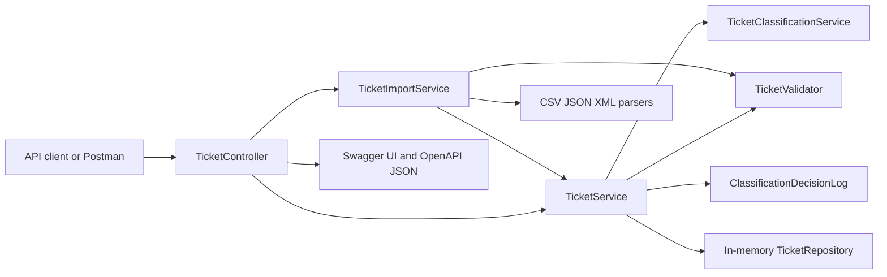

# Homework 2: Intelligent Customer Support API

> **Date Submitted**: 2026-05-02  
> **AI Tools Used**: Codex local desktop workflow with Superpowers planning, TDD, and verification discipline. See [AI_USAGE.md](AI_USAGE.md) for the Context-Model-Prompt log.

## Overview

This project implements Homework 2 Tasks 1-5 for an intelligent customer support ticket service. It supports ticket CRUD operations, filtering, CSV/JSON/XML bulk import, deterministic rule-based auto-classification for ticket category and priority, comprehensive tests, coverage reporting, sample data, and multi-audience documentation.

## Features

- Create, list, filter, get, update, and delete support tickets.
- Bulk import valid records from CSV, JSON, and XML with partial failure summaries.
- Rule-based auto-classification on ticket creation and import by default.
- Explicit `POST /tickets/{id}/auto-classify` endpoint.
- Classification confidence, reasoning, keywords, suggested category/priority, timestamp, and manual override evidence stored with tickets.
- Manual category/priority overrides during create, import, and update.
- In-memory repository and decision log for focused homework scope.
- Swagger UI at `http://localhost:8080/api-docs`.
- Automated MockMvc/JUnit test suite with JaCoCo coverage gate above 85%.
- Manual QA assets: Postman collection, sample requests, sample data, and lifecycle scripts.

## Architecture



## Quick Start

```bash
cd homework-2
mvn test jacoco:report
mvn spring-boot:run
```

The API starts at `http://localhost:8080`.

Swagger UI is available at `http://localhost:8080/api-docs` while the API is running.

PowerShell managed lifecycle:

```powershell
cd homework-2
./demo/start.ps1
./demo/stop.ps1
```

## Project Structure

```text
homework-2/
├── src/main/java/com/setu/support/
├── src/test/java/com/setu/support/ticket/
├── src/test/resources/fixtures/
├── demo/
│   ├── sample_tickets.csv
│   ├── sample_tickets.json
│   ├── sample_tickets.xml
│   ├── classification_tickets.csv
│   └── sample-requests.http
├── docs/
│   ├── support-ticket-api.postman_collection.json
│   ├── screenshots/test_coverage.png
│   └── superpowers/plans/
├── AI_USAGE.md
├── API_REFERENCE.md
├── ARCHITECTURE.md
├── HOWTORUN.md
└── TESTING_GUIDE.md
```

## Documentation

- [HOWTORUN.md](HOWTORUN.md): setup, run commands, smoke checks, and troubleshooting.
- [API_REFERENCE.md](API_REFERENCE.md): endpoint contract, classification fields, and examples.
- [ARCHITECTURE.md](ARCHITECTURE.md): design rationale, data flow, and trade-offs.
- [TESTING_GUIDE.md](TESTING_GUIDE.md): automated and manual QA instructions.
- [AI_USAGE.md](AI_USAGE.md): Context-Model-Prompt workflow and AI assistance log.
- [CHANGELOG.md](CHANGELOG.md): implementation history.

## Deliverables

- Source code: `src/main/java/com/setu/support/`
- Automated tests: `src/test/java/com/setu/support/ticket/`
- Test fixtures: `src/test/resources/fixtures/`
- Sample data for manual import: `demo/sample_tickets.csv`, `demo/sample_tickets.json`, `demo/sample_tickets.xml`
- Coverage report: `target/site/jacoco/index.html`
- Coverage screenshot: `docs/screenshots/test_coverage.png`

## Scope Notes

The service intentionally uses in-memory ticket storage and an in-memory classification decision log. Task 2 uses deterministic local rules rather than an LLM or integrated agentic workflow so the behavior is transparent, auditable, and easy to test.
