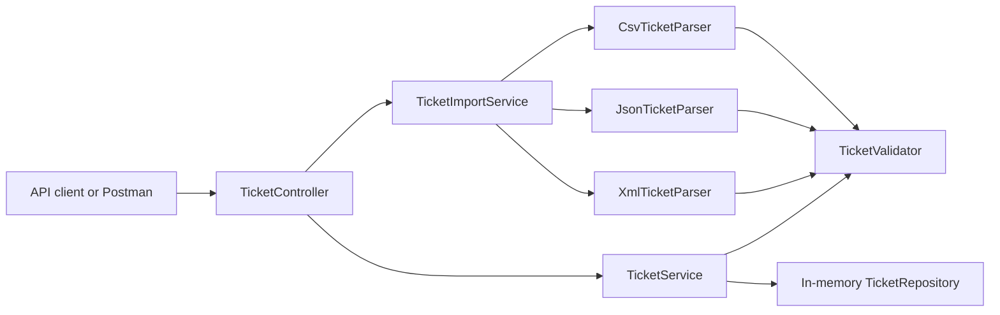

# Homework 2: Support Ticket Import API

> **Student Name**: [Your Name]  
> **Date Submitted**: [Date]  
> **AI Tools Used**: Codex local desktop workflow with Superpowers planning/execution discipline

## Overview

This project implements Task 1 of Homework 2: an API-only intelligent customer support ticket service. It supports ticket CRUD operations, filtering, validation, and bulk import from CSV, JSON, and XML files. Auto-classification is intentionally deferred to Task 2.

## Features

- Create, list, filter, get, update, and delete support tickets.
- Bulk import valid records from CSV, JSON, and XML.
- Partial import success with per-record validation errors.
- In-memory repository for a focused part 1 API implementation.
- Sanitized API errors for validation, malformed bodies, malformed imports, unsupported media types, and missing tickets.
- Automated MockMvc test suite with JaCoCo coverage reporting.
- Manual QA assets: Postman collection, sample requests, sample data, and lifecycle scripts.

## Architecture



## Quick Start

```bash
cd homework-2
mvn test jacoco:report
mvn spring-boot:run
```

The API starts at `http://localhost:8080`.

Swagger UI is available at `http://localhost:8080/api-docs` while the API is running.

PowerShell managed lifecycle:

```powershell
cd homework-2
./demo/start.ps1
./demo/stop.ps1
```

## Project Structure

```text
homework-2/
├── src/main/java/com/setu/support/
├── src/test/java/com/setu/support/ticket/
├── demo/
│   ├── sample_tickets.csv
│   ├── sample_tickets.json
│   ├── sample_tickets.xml
│   └── sample-requests.http
├── docs/
│   ├── support-ticket-api.postman_collection.json
│   └── superpowers/plans/
├── API_REFERENCE.md
├── ARCHITECTURE.md
├── HOWTORUN.md
└── TESTING_GUIDE.md
```

## Documentation

- [HOWTORUN.md](HOWTORUN.md): setup, run commands, and smoke checks.
- [API_REFERENCE.md](API_REFERENCE.md): endpoint contract and examples.
- [ARCHITECTURE.md](ARCHITECTURE.md): design rationale and data flow.
- [TESTING_GUIDE.md](TESTING_GUIDE.md): automated and manual QA instructions.
- [CHANGELOG.md](CHANGELOG.md): implementation history.

## Scope Notes

Task 1 stores tickets in memory. Classification confidence, decision logs, and `POST /tickets/{id}/auto-classify` are reserved for Task 2.
