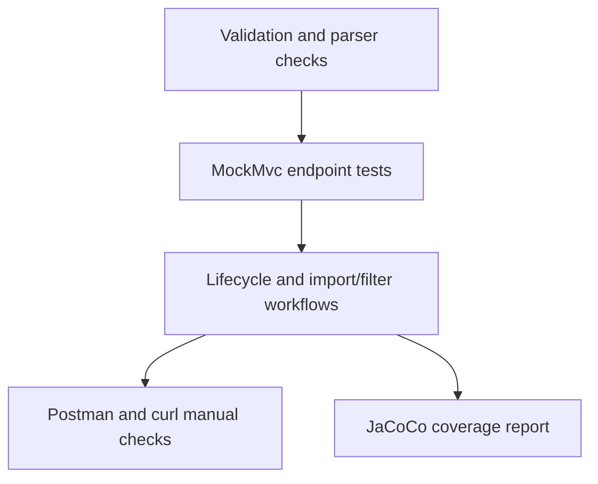

# Testing Guide

## Test Strategy



## Automated Tests

Run:

```bash
cd homework-2
mvn test jacoco:report
```

Current automated suites:

| Test file | Coverage area |
| --- | --- |
| `TicketApiTest` | CRUD, filtering, status codes, malformed JSON |
| `TicketModelValidationTest` | required fields, email, lengths, enums, metadata, timestamp consistency |
| `TicketImportCsvTest` | CSV success, partial failure, malformed CSV, explicit format |
| `TicketImportJsonTest` | JSON success, partial failure, malformed JSON, empty array |
| `TicketImportXmlTest` | XML success, partial failure, malformed XML, missing required fields |
| `TicketIntegrationTest` | lifecycle and import-then-filter workflows |
| `TicketPerformanceTest` | 50 CSV, 20 JSON, and 30 XML imports within threshold |

Coverage report:

`target/site/jacoco/index.html`

Capture the final coverage screenshot as:

`docs/screenshots/test_coverage.png`

## Test Data

| File | Purpose |
| --- | --- |
| `demo/sample_tickets.csv` | 50 valid CSV tickets |
| `demo/sample_tickets.json` | 20 valid JSON tickets |
| `demo/sample_tickets.xml` | 30 valid XML tickets |
| `demo/invalid_tickets.csv` | invalid rows for partial failure checks |
| `demo/invalid_tickets.json` | invalid records for partial failure checks |
| `demo/invalid_tickets.xml` | invalid records for partial failure checks |
| `demo/malformed_tickets.json` | malformed file for hard import failure checks |

## Manual Test Checklist

1. Start the API with `./demo/start.ps1` or `mvn spring-boot:run`.
2. Import `docs/support-ticket-api.postman_collection.json` into Postman.
3. Run `Create ticket`; confirm `201` and capture the returned `id`.
4. Run `List tickets`; confirm the created ticket appears.
5. Run `Filter tickets`; confirm filtered results only include matching category, priority, and source.
6. Run `Get ticket by id`; confirm it returns the stored ticket.
7. Run `Update ticket`; confirm status changes and `resolved_at` is set for `resolved`.
8. Run `Delete ticket`; confirm `204`, then run get-by-id and confirm `404`.
9. Run CSV, JSON, and XML imports with sample files; confirm successful counts match 50, 20, and 30.
10. Run invalid fixture imports; confirm `200` partial failure summaries with field-level errors.
11. Run malformed import failure; confirm `400` with a meaningful `Malformed import` message.
12. Run validation failure; confirm `400` with field-level validation details.
13. Run `mvn test jacoco:report`; confirm line coverage exceeds 85%. The latest clean verification run reported 89.76% line coverage.

## Performance Benchmark

| Scenario | Data size | Expected result |
| --- | ---: | --- |
| CSV import | 50 records | completes inside 5 seconds |
| JSON import | 20 records | completes inside 5 seconds |
| XML import | 30 records | completes inside 5 seconds |

The automated benchmark is intentionally small and stable for local reviewer machines.
