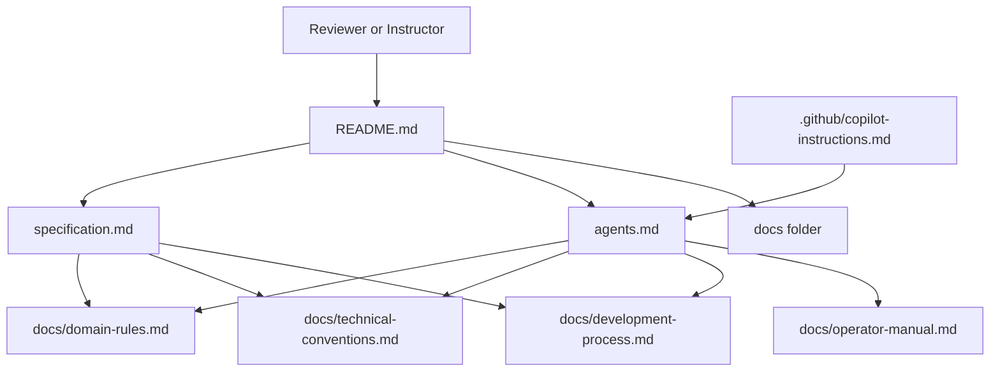

# Homework 3: Specification-Driven Design Harness

> **Author**: Igor Tanatarov  
> **Status**: Outer harness prepared before feature selection  
> **Scope**: Documentation-only specification package for a future finance-oriented application feature.

## Student And Task Summary

Homework 3 asks for a specification package for a finance-oriented application. This first increment establishes the reusable outer harness before choosing the exact feature. The actual product specification, domain research, edge-case catalog, and performance targets will be completed after the feature and researched FinTech constraints are selected.

No application code, API implementation, or UI implementation belongs in this homework. The graded artifact is the specification package and the clarity of its supporting process.

## Package Map

| File | Responsibility |
| --- | --- |
| [specification.md](specification.md) | Core layered product specification once the finance feature is selected. Currently a deferred scaffold. |
| [agents.md](agents.md) | AI and human agent behavior contract for future work in this homework package. |
| [.github/copilot-instructions.md](.github/copilot-instructions.md) | Editor-specific AI rules that point Copilot-style tools back to the package rules. |
| [docs/domain-rules.md](docs/domain-rules.md) | Deferred researched FinTech, banking, compliance, and data-handling rules. |
| [docs/technical-conventions.md](docs/technical-conventions.md) | Feature-neutral engineering conventions for a future finance feature. |
| [docs/development-process.md](docs/development-process.md) | Required spec-first workflow without assuming external addons. |
| [docs/operator-manual.md](docs/operator-manual.md) | Feature-neutral internal operator and compliance manual template. |
| [CHANGELOG.md](CHANGELOG.md) | Increment history for Homework 3. |

## Rationale

The package is split so each layer has one job. The future `specification.md` will own product intent, traceability, low-level tasks, edge cases, verification, and measurable performance expectations. Supporting files keep long-lived conventions out of the spec body while still making them enforceable by agents and reviewers.

The finance feature is intentionally not selected in this increment. That avoids inventing unsupported domain rules or arbitrary performance numbers before research and scope selection. The deferred spec scaffold still preserves the required Homework 3 structure so the next step can fill in the feature-specific content without reorganizing the package.

Verification depth will be chosen in the future spec according to the selected feature's risk profile. For this harness increment, verification focuses on document presence, clear responsibility boundaries, working links, and the absence of accidental dependency on optional tools such as Superpowers or GitHub Spec Kit.

## Industry Best Practices

The package prepares for FinTech-sensitive work without claiming researched regulatory conclusions yet:

- Sensitive-data minimization and redaction expectations are introduced in [agents.md](agents.md) and [docs/technical-conventions.md](docs/technical-conventions.md).
- Auditability, operator evidence, escalation, and separation of duties are framed in [docs/operator-manual.md](docs/operator-manual.md).
- Idempotency, money formatting, stable identifiers, timestamp handling, error semantics, and pagination conventions are defined in [docs/technical-conventions.md](docs/technical-conventions.md).
- Traceability from objectives to tasks, verification, documentation updates, and changelog discipline are enforced in [docs/development-process.md](docs/development-process.md).
- Researched domain-specific best practices will be added to [docs/domain-rules.md](docs/domain-rules.md) and then referenced from the final [specification.md](specification.md).

## Current Limits

This increment does not choose the finance feature, define APIs, design a UI, select a persistence model, or set final performance targets. Those decisions belong in the next specification step after domain research.
