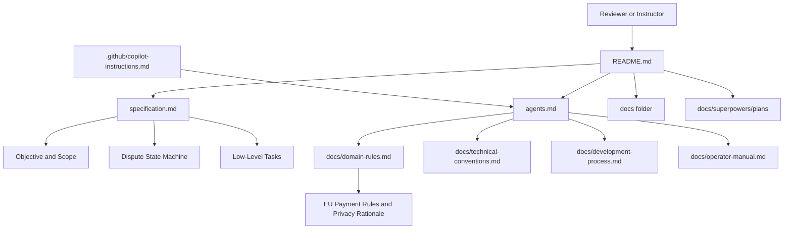

# Homework 3: EU Payment-Account Dispute Intake Specification

> **Author**: Igor Tanatarov  
> **Status**: Selected feature specification package
> **Scope**: Documentation-only specification for dispute intake and internal tracking in an EU/EEA payment-account context.

## Student And Task Summary

Homework 3 asks for a specification package for a finance-oriented application. This submission specifies **Dispute Intake**: users can file disputes against posted transactions, while authorized internal ops and compliance users can review cases, request more information, assign statuses, and record audit-safe notes.

No application code, API implementation, UI implementation, database migration, chargeback integration, provisional credit workflow, regulator reporting, or real file handling belongs in this homework. The graded artifact is the written specification package and its traceability from objective to low-level tasks.

## Package Map

| File or folder | Responsibility |
| --- | --- |
| **Required deliverables** | Assignment files required by `TASKS.md`. |
| [specification.md](specification.md) | Core layered Dispute Intake specification: objective, scope, state machine, data concepts, edge cases, verification, performance, and low-level tasks. |
| [agents.md](agents.md) | AI and human agent behavior contract for Dispute Intake documentation and future implementation planning. |
| [.github/copilot-instructions.md](.github/copilot-instructions.md) | Editor-specific AI rules that point Copilot-style tools back to the package rules. |
| [README.md](README.md) | Reviewer entry point, package map, rationale, ownership rules, and best-practice references. |
| **Active supporting docs** | Normative package docs that support the selected Dispute Intake feature. |
| [docs/domain-rules.md](docs/domain-rules.md) | EU payment-account domain rationale and scoped PSD2, GDPR, DORA, EBA, complaints, and ADR context. |
| [docs/technical-conventions.md](docs/technical-conventions.md) | Reusable engineering conventions, including audit, redaction, idempotency, state machines, IDs, timestamps, errors, and pagination. |
| [docs/development-process.md](docs/development-process.md) | Required spec-first workflow without assuming external addons. |
| [docs/operator-manual.md](docs/operator-manual.md) | Feature-specific internal operator, queue, review, escalation, and audit-note expectations for Dispute Intake. |
| **Evidence and archive docs** | Historical evidence that explains how the package evolved. |
| [docs/low-level-task-rewrite-handoff.md](docs/low-level-task-rewrite-handoff.md) | Focused handoff for the next low-level task rewrite increment. |
| [docs/superpowers/plans/](docs/superpowers/plans/) | Historical AI-assistance implementation plans. These files explain how the package evolved and are not active normative requirements. |
| [CHANGELOG.md](CHANGELOG.md) | Increment history for Homework 3. |

## Ownership And Non-Redundancy Rules

To keep the harness easy to maintain, each document has one primary owner:

- `specification.md` owns product behavior, traceability, edge cases, verification, performance, and feature-specific acceptance criteria.
- `docs/domain-rules.md` owns regulatory and domain rationale, scoped assumptions, sensitive-data categories, and rules to avoid without further research.
- `docs/technical-conventions.md` owns reusable engineering conventions only; `specification.md` specializes those conventions for Dispute Intake.
- `docs/operator-manual.md` owns operator workflows, queues, role-specific review behavior, audit-safe notes, and escalation behavior.
- `agents.md` owns agent workflow, context order, and enforcement routing. It should link to source documents instead of copying their full policy tables.
- `.github/copilot-instructions.md` stays a compact editor-specific pointer to `agents.md` and the active source-of-truth documents.
- `docs/superpowers/plans/` contains historical plan artifacts. They may include older scaffold language and should not override active package docs.

## Rationale

Dispute Intake was chosen because it naturally fits a regulated finance specification assignment without requiring actual money movement. It has clear end-user and internal ops/compliance stakeholders, a meaningful state machine, sensitive data boundaries, audit requirements, role permissions, failure modes, verification expectations, and performance targets.

The jurisdiction decision is explicit: the primary framing is an EU/EEA payment-account service. The specification uses PSD2 as payment-service and unauthorized-or-incorrect-transaction context, GDPR as privacy and minimization rationale, DORA and EBA ICT/security guidance as operational resilience rationale, and EBA complaints-handling guidance as complaint governance context. These sources shape conservative requirements, but the package does not claim legal compliance.

The scope is intentionally controlled. The feature is intake and internal tracking only. It does not implement chargebacks, provisional credits, refunds, legal response deadlines, card-network arbitration, regulator reporting, external ADR workflows, or binary evidence handling. Those exclusions keep the homework realistic and avoid unsupported domain claims.

Performance targets are labeled as assumed homework targets. User dispute creation p95 <= 500 ms and dispute detail p95 <= 400 ms are appropriate because the flows are bounded case-record operations. Ops queue p95 <= 800 ms is reasonable because it includes filters, pagination, role shaping, and age-based ordering. Audit writes must complete before success because unaudited dispute state changes would defeat the core compliance goal.

Verification depth is intentionally broad for a documentation-only assignment. The spec maps each mid-level objective to future test categories, manual review evidence, audit checks, redaction checks, permission checks, stale-state checks, and performance smoke checks so an engineering team or AI agent could implement without guessing.

## Industry Best Practices

The package applies FinTech-sensitive practices without overclaiming:

- EU payment-service rationale and scoped regulatory limits are documented in [docs/domain-rules.md](docs/domain-rules.md) and referenced from [specification.md](specification.md).
- Synthetic-data, minimization, and redaction expectations appear in [specification.md](specification.md), [agents.md](agents.md), [docs/domain-rules.md](docs/domain-rules.md), and [docs/technical-conventions.md](docs/technical-conventions.md).
- Auditability, operator evidence, sensitive-action review, escalation, and separation of duties are framed in [docs/operator-manual.md](docs/operator-manual.md).
- Idempotency, state machines, money formatting, stable identifiers, timestamp handling, error semantics, and pagination conventions are defined in [docs/technical-conventions.md](docs/technical-conventions.md) and specialized in [specification.md](specification.md).
- Traceability from objectives to tasks, verification, documentation updates, and changelog discipline are enforced in [docs/development-process.md](docs/development-process.md) and the low-level task table in [specification.md](specification.md).

## Current Limits

This package does not create a working application. It also does not define exact legal retention periods, statutory notice periods, refund deadlines, or regulator reporting outcomes. A real implementation would need legal, compliance, privacy, security, and payments review before launch.
