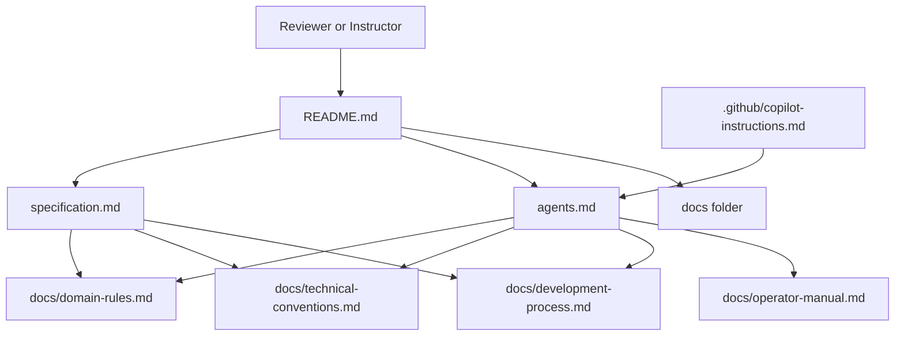

# Homework 3: Specification-Driven Design Harness

> **Author**: Igor Tanatarov  
> **Status**: Outer harness plus agent-control baseline prepared before feature selection  
> **Scope**: Documentation-only specification package for a future finance-oriented application feature.

## Student And Task Summary

Homework 3 asks for a specification package for a finance-oriented application. The current package establishes the reusable outer harness and a homework-sized control baseline before choosing the exact feature. The actual product specification, feature-specific edge-case catalog, and final performance targets will be completed after the feature and researched FinTech constraints are selected.

No application code, API implementation, or UI implementation belongs in this homework. The graded artifact is the specification package and the clarity of its supporting process.

## Package Map

| File | Responsibility |
| --- | --- |
| [specification.md](specification.md) | Core layered product specification scaffold and Agent-Control Baseline for the future feature. |
| [agents.md](agents.md) | AI and human agent behavior contract, including enforceable baseline-control rules for future feature work. |
| [.github/copilot-instructions.md](.github/copilot-instructions.md) | Editor-specific AI rules that point Copilot-style tools back to the package rules. |
| [docs/domain-rules.md](docs/domain-rules.md) | Researched, scoped banking-style control baseline plus deferred feature-specific domain rules. |
| [docs/technical-conventions.md](docs/technical-conventions.md) | Feature-neutral engineering conventions, including audit, redaction, idempotency, and state-machine expectations. |
| [docs/development-process.md](docs/development-process.md) | Required spec-first workflow without assuming external addons. |
| [docs/operator-manual.md](docs/operator-manual.md) | Feature-neutral internal operator, review, and escalation manual template. |
| [CHANGELOG.md](CHANGELOG.md) | Increment history for Homework 3. |

## Rationale

The package is split so each layer has one job. The future `specification.md` will own product intent, traceability, low-level tasks, edge cases, verification, and measurable performance expectations. Supporting files keep long-lived conventions out of the spec body while still making them enforceable by agents and reviewers.

The finance feature is intentionally not selected in this increment. That avoids inventing unsupported state machines, user flows, retention periods, or performance numbers before research and scope selection. The Agent-Control Baseline adds only reusable controls that are important in a finance setting and can later be enforced by schemas, tests, CI checks, permissions, and review gates.

The research report that motivated this increment assumed a real EU banking application. This package trims those enterprise controls to homework-realistic rules. It keeps synthetic data, permission boundaries, auditability, redaction, idempotency, explicit states, sensitive-operator review, and verification mapping. It defers real-bank governance programs, vendor contracts, regulator reporting deadlines, and fixed legal retention rules.

Verification depth will be chosen in the future spec according to the selected feature's risk profile. For this harness increment, verification focuses on document presence, clear responsibility boundaries, working links, and the absence of accidental dependency on optional tools such as Superpowers or GitHub Spec Kit.

## Industry Best Practices

The package prepares for FinTech-sensitive work without claiming that this homework is a compliant banking system:

- Synthetic-data, minimization, and redaction expectations are introduced in [specification.md](specification.md), [agents.md](agents.md), and [docs/technical-conventions.md](docs/technical-conventions.md).
- Auditability, operator evidence, sensitive-action review, escalation, and separation of duties are framed in [docs/operator-manual.md](docs/operator-manual.md).
- Idempotency, state machines, money formatting, stable identifiers, timestamp handling, error semantics, and pagination conventions are defined in [docs/technical-conventions.md](docs/technical-conventions.md).
- Traceability from objectives to tasks, verification, documentation updates, and changelog discipline are enforced in [docs/development-process.md](docs/development-process.md).
- Scoped EU banking-style rationale and the eight baseline controls are captured in [docs/domain-rules.md](docs/domain-rules.md) and referenced from [specification.md](specification.md).

## Current Limits

This increment does not choose the finance feature, define APIs, design a UI, select a persistence model, set final performance targets, create implementation code, or assert real regulatory compliance. Those decisions belong in the next specification step after feature selection and domain research.
