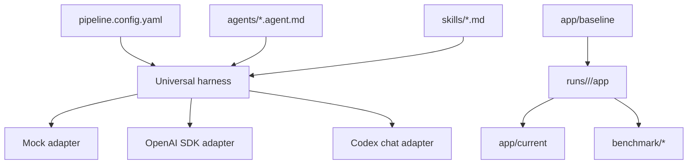
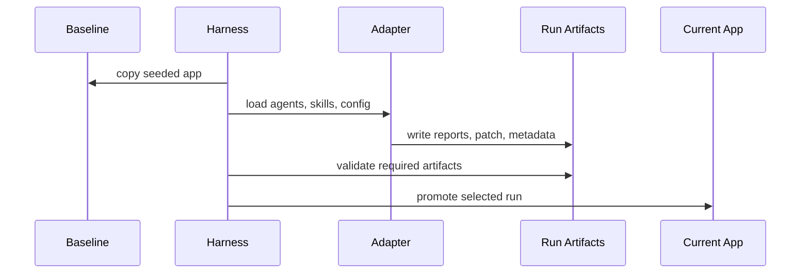

# Architecture

## Components

The harness owns deterministic workflow concerns: config loading, agent spec validation, workspace creation, artifact validation, promotion, and comparison. Adapters own execution style.

## Run Isolation

`app/baseline` is the immutable seeded input. Each pipeline run copies it to `runs/bug-001/<run-id>/app`. Fixes and generated tests happen only inside that run workspace. Promotion copies a verified run into `app/current`.

## Adapter Behavior

- `mock`: deterministic local adapter that executes every configured stage in order, loads the stage skills, records model policy metadata, performs the planned fixes, and emits all required artifacts.
- `openai-sdk`: live adapter entry point; records a blocked run when credentials/package support is absent.
- `codex-chat`: prompt packet preparation and artifact-contract validation for chat execution.

## State Flow

## Safety Rules

- Do not edit previous homework folders.
- Do not edit `app/baseline` after seeded defects are established.
- Adapters write only inside `runs/<scenario>/<run-id>`.
- `security-verifier` writes a report only and does not edit code.
- Missing OpenAI credentials are reported as blocked, not hidden.

## Known Limitations

- The live OpenAI SDK path is a credential-aware shell in this dependency-free homework folder.
- Screenshots are represented by reproducible SVG evidence files under `docs/screenshots`.
- Benchmark scoring is a lightweight comparison of completed run metadata, not a statistically rigorous model evaluation.
