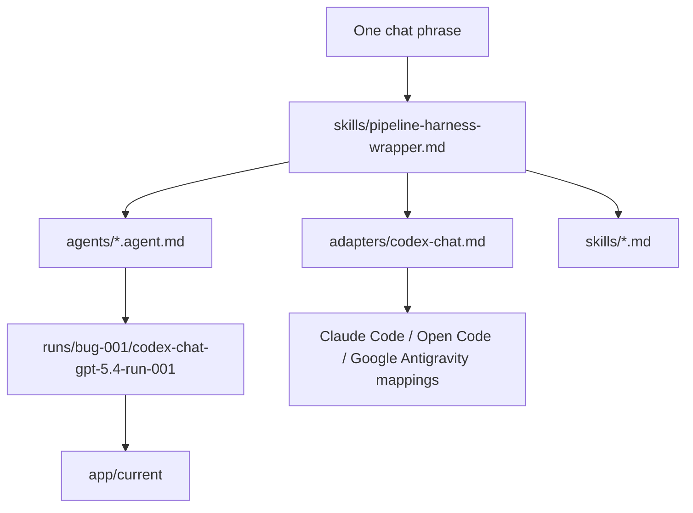
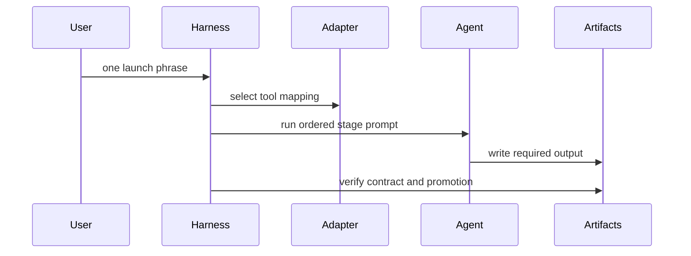

# Architecture

## Components

The harness is a Markdown workflow controller. It defines context loading, stage
order, write boundaries, artifact names, stop conditions, and completion checks.
Adapters translate that same contract into individual coding-agent tools.

## Instruction Hierarchy

## Run Isolation

`app/baseline` is the immutable seeded input. The canonical run lives at
`runs/bug-001/codex-chat-gpt-5.4-run-001`. Source edits happen in that run app first. After the
required reports and checks are complete, the fixed app is represented in
`app/current`.

## Adapter Behavior

- `codex-chat.md`: canonical adapter for the submitted run.
- `claude-code.md`: maps the same hierarchy to Claude Code.
- `open-code.md`: maps the same hierarchy to Open Code.
- `google-antigravity.md`: maps the same hierarchy to Google Antigravity.

Adapters preserve the same artifact contract. They do not include executable
wrapper code.

## Safety Rules

- Do not edit previous homework folders.
- Do not edit `app/baseline` after seeded defects are established.
- Code edits before promotion stay inside the selected run app.
- `security-verifier` writes a report only and does not edit code.
- Missing tool features are recorded honestly in run metadata or command logs.

## Known Limitations

- The pipeline is not headless; it is an agentic chat workflow.
- Benchmark files are manually reviewed comparison artifacts, not generated
  benchmark output.
- Screenshots are SVG evidence files that document the text-pipeline workflow.
