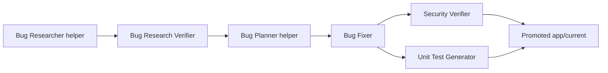

# Homework 4: Agentic Bug-Fixing Pipeline

Author: `itanatarov`

## Overview

This homework implements a reproducible four-agent pipeline around a small Node.js quote calculator. The baseline app intentionally contains two logic bugs and one security issue. The pipeline copies that baseline into an isolated run workspace, verifies research, applies fixes, reviews security, generates unit tests, promotes a verified fixed app, and compares run artifacts.



## What Is Included

- Required agents in `agents/`: research verifier, bug fixer, security verifier, and unit test generator.
- Helper stages for the assignment run order: bug researcher and bug planner.
- Required skills in `skills/`: research quality measurement and FIRST unit test criteria.
- Baseline app in `app/baseline` with seeded defects preserved.
- Fixed promoted app in `app/current`.
- Run artifacts in `runs/bug-001/run-001`.
- Benchmark outputs in `benchmark/`.
- Demo helpers in `demo/`.

## Model And Adapter Choices

| Stage | Model policy | Model | Reasoning | Why |
| --- | --- | --- | --- | --- |
| Bug Researcher | `research-high` | `gpt-5.4` | high | Needs accurate source and symptom correlation. |
| Research Verifier | `verification-high` | `gpt-5.4` | high | Bad verification can mislead every later stage. |
| Bug Planner | `planning-high` | `gpt-5.4` | high | Converts evidence into controlled edits. |
| Bug Fixer | `implementation-medium` | `gpt-5.3-codex` | medium | Bounded code edits from a concrete plan. |
| Security Verifier | `security-high` | `gpt-5.4` | high | Security review has higher blast radius. |
| Unit Test Generator | `test-medium` | `gpt-5.3-codex` | medium | Bounded test generation for changed code. |

The default `mock` adapter is deterministic so reviewers can run the homework without credentials. It executes every configured stage in order, loads the referenced skills, and records the stage model policy metadata in `run-metadata.json`. The `openai-sdk` adapter records a blocked run when `OPENAI_API_KEY` is unavailable. The `codex-chat` adapter prepares prompt packets for chat-assisted execution and validation.

## Quick Start

```powershell
cd homework-4
npm run verify:baseline
npm run pipeline:mock -- --scenario bug-001 --run run-001
npm run promote -- --scenario bug-001 --run run-001
npm test
npm run compare -- --scenario bug-001
```

## Benchmark Summary

`benchmark/bug-001-comparison.md` scores completed valid runs across correctness, security remediation, test quality, maintainability, and reproducibility. Blocked or prompt-preparation runs remain in `runs/` as evidence but are not included in the scored table. `run-001` is the promoted deterministic run.

## Documentation

- [HOWTORUN.md](HOWTORUN.md)
- [API_REFERENCE.md](API_REFERENCE.md)
- [ARCHITECTURE.md](ARCHITECTURE.md)
- [TESTING_GUIDE.md](TESTING_GUIDE.md)
- [CHANGELOG.md](CHANGELOG.md)
