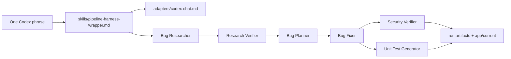

# Homework 4: Pure Agentic Bug-Fixing Pipeline

Author: `itanatarov`  
**AI Tools Used**: Codex (Steps 0–10); Google Antigravity (Step 11 & universal adapter alignment)

## Overview

This homework implements a four-agent bug-fixing pipeline as a text-first
agentic workflow. The primary execution interface is one Codex chat phrase:

```text
Run HW4 pipeline
```

That phrase loads the Markdown harness, adapter instructions, six agent specs,
required skills, scenario files, and artifact contract. No JavaScript harness,
SDK adapter, mock adapter, pipeline script, or demo runner is part of the scaled
submission. The only executable JavaScript is the sample quote-calculator app
and its tests.



## What Is Included

- Required agents in `agents/`: research verifier, bug fixer, security verifier,
  and unit test generator.
- Helper stages for the assignment run order: bug researcher and bug planner.
- Required skills in `skills/`: research quality measurement and FIRST unit test
  criteria.
- Text harness skill: `skills/pipeline-harness-wrapper.md`.
- Portable adapter instructions in `adapters/` for Codex Chat, Claude Code,
  Open Code, Google Antigravity, and a generic capable-agent fallback.
- Baseline app in `app/baseline` with seeded defects preserved.
- Fixed app in `app/current`.
- Canonical completed run evidence in `runs/bug-001/codex-chat-gpt-5.4-run-001`.
- Text comparison rubric and scored evidence in `benchmark/`.

## Model Policy Choices

Portable agents declare model policies only. Concrete model names are selected
by each adapter; Codex-specific choices live in `adapters/codex-chat.md`.

| Stage | Model policy | Reasoning | Why |
| --- | --- | --- | --- |
| Bug Researcher | `research-high` | high | Needs accurate source and symptom correlation. |
| Research Verifier | `verification-high` | high | Bad verification can mislead every later stage. |
| Bug Planner | `planning-high` | high | Converts evidence into controlled edits. |
| Bug Fixer | `implementation-medium` | medium | Bounded code edits from a concrete plan. |
| Security Verifier | `security-high` | high | Security review has higher blast radius. |
| Unit Test Generator | `test-medium` | medium | Bounded test generation for changed code. |

## Quick Start

1. In Codex chat, run the canonical phrase shown above.
2. Review the resulting artifacts in `runs/bug-001/codex-chat-gpt-5.4-run-001`.
3. Verify the fixed app:

```powershell
node --test --test-isolation=none homework-4/app/current/tests/*.test.js
```

4. Verify the baseline still contains the seeded defects:

```powershell
node --test --test-isolation=none homework-4/app/baseline/tests/*.test.js
```

The baseline command is expected to fail. That failure is evidence that the
input app still contains the intentional bugs and security issue.

## Documentation

- [HOWTORUN.md](HOWTORUN.md)
- [API_REFERENCE.md](API_REFERENCE.md)
- [ARCHITECTURE.md](ARCHITECTURE.md)
- [TESTING_GUIDE.md](TESTING_GUIDE.md)
- [CHANGELOG.md](CHANGELOG.md)
