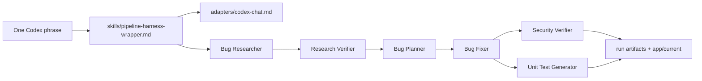

# Homework 4: Pure Agentic Bug-Fixing Pipeline

Author: `Igor Tanatarov`

**AI Tools Used**: Codex (primary implementation and final prep); Google Antigravity (adapter and harness refinement); Open Code (adapter validation and benchmark runs)

*Note: Additional validation runs were performed with several Open Code models, including Nemotron 3 Super (free), Claude Sonnet 4.5, Big Pickle, and Gemini 3.5 Flash.*

## Overview

This homework implements a four-agent bug-fixing pipeline as a text-first
agentic workflow. The primary execution interface is one Codex chat phrase:

```text
Run HW4 pipeline
```

That phrase loads the Markdown harness, adapter instructions, six agent specs,
required skills, scenario files, and artifact contract. No JavaScript harness,
SDK adapter, mock adapter, pipeline script, or demo runner is part of the scaled
submission. The only executable JavaScript is the sample quote-calculator app
and its tests.



## What Is Included

- Required agents in `agents/`: research verifier, bug fixer, security verifier,
  and unit test generator.
- Helper stages for the assignment run order: bug researcher and bug planner.
- Required skills in `skills/`: research quality measurement and FIRST unit test
  criteria.
- Text harness skill: `skills/pipeline-harness-wrapper.md`.
- Portable adapter instructions in `adapters/` for Codex Chat, Claude Code,
  Open Code, Google Antigravity, and a generic capable-agent fallback.
- Baseline app in `app/baseline` with seeded defects preserved.
- Fixed app in `app/current`.
- Immutable source run evidence in `runs/bug-001/`.
- Normalized comparison evidence in `benchmark/bug-001/runs/run-001-codex-chat-gpt-5.4`
  through `benchmark/bug-001/runs/run-006-open-code-gemini-3.5-flash`.
- Text comparison rubric and scored evidence in `benchmark/`.

## Model Policy Choices

Portable agents declare model policies only. Concrete model names are selected
by each adapter; Codex-specific choices live in `adapters/codex-chat.md`.
This is an intentional portability decision: the `*.agent.md` frontmatter keeps
stable `model_policy` and `reasoning_effort` values so the same agents can run
under Codex Chat, Google Antigravity, Claude Code, Open Code, or a generic
agentic tool. Concrete model selections are adapter-specific and are recorded in
the adapter instructions and run metadata rather than duplicated in every agent
file.

| Stage | Model policy | Reasoning | Why |
| --- | --- | --- | --- |
| Bug Researcher | `research-high` | high | Needs accurate source and symptom correlation. |
| Research Verifier | `verification-high` | high | Bad verification can mislead every later stage. |
| Bug Planner | `planning-high` | high | Converts evidence into controlled edits. |
| Bug Fixer | `implementation-medium` | medium | Bounded code edits from a concrete plan. |
| Security Verifier | `security-high` | high | Security review has higher blast radius. |
| Unit Test Generator | `test-medium` | medium | Bounded test generation for changed code. |

## AI Tools And Workflow Reflections

Most of the work was done in the Codex app with Codex. The initial
implementation included a Node.js script so the pipeline could be run literally
through a slash-command-style entry point, but that was scaled down to keep the
submission as a text-only agentic pipeline.

That confusion reopened the question of how different agentic tools interpret
"commands" and skill invocation. I intentionally extended the homework by
making the pipeline flexible enough to port across several tools I have been
looking at: Codex, Google Antigravity, and Open Code. They use different model
sets; Open Code in particular can run free models, OpenAI subscription models,
and a broad range of OpenRouter models.

I used Google Antigravity to make further improvements to the pipeline:
cleaner separation of agents, skills, the universal harness, and tool-specific
adapters. I then had Antigravity and Open Code improve their respective
adapters. Antigravity performed well in my opinion; it pointed out that its
specific orchestration capabilities were underused by the generic instructions,
so I let it add more concrete details to its adapter. The Open Code adapter
probably still needs more work because it supports such a wide variety of model
providers and model behaviors.

Running the pipeline via Antigravity with Gemini 3.5 Flash did not finish
because it hit free-account limits. Running the pipeline via Open Code showed
how differently the models reason and orchestrate. The end result was successful
for all completed runs, although this small scenario is probably too simple to
separate them strongly. Gemini was aggressive about spawning sub-agents, while
Nemotron 3 Super (free) complained that it was too restricted in the environment
and did not spawn any.

One notable hiccup was with Nemotron: after running the pipeline, it got caught
up in the process and started trying to finish and improve the whole homework,
which it had not been asked to do. I stopped that and reverted those unrelated
changes. Per-token paid models cost consistently about `$2` per pipeline run.

All tools used understand skill invocation either by name or by recognized
intent, but none has Claude Code-style `/skill-name` commands. The closest
option to that is skill reference via `$skill-name` in Codex CLI.

## Quick Start

1. In Codex chat, run the canonical phrase shown above.
2. Review normalized comparison artifacts in `benchmark/bug-001/` and source
   snapshots in `runs/bug-001/`.
3. Verify the fixed app:

```powershell
node --test --test-isolation=none homework-4/app/current/tests/*.test.js
```

4. Verify the baseline still contains the seeded defects:

```powershell
node --test --test-isolation=none homework-4/app/baseline/tests/*.test.js
```

The baseline command is expected to fail. That failure is evidence that the
input app still contains the intentional bugs and security issue.

## Documentation

- [HOWTORUN.md](HOWTORUN.md)
- [API_REFERENCE.md](API_REFERENCE.md)
- [ARCHITECTURE.md](ARCHITECTURE.md)
- [TESTING_GUIDE.md](TESTING_GUIDE.md)
- [CHANGELOG.md](CHANGELOG.md)
