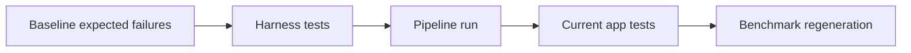

# Testing Guide

## Test Strategy

The baseline tests intentionally fail. `verify:baseline` is the passing gate for proving the seeded defects still exist. After promotion, `npm test` runs harness tests plus fixed current app tests.

## Command Matrix

| Command | Expected Result |
| --- | --- |
| `npm run app:baseline:test` | Fails with the three seeded defects. |
| `npm run verify:baseline` | Passes when seeded defects are reproduced. |
| `npm run test:harness` | Passes harness and adapter contract tests. |
| `npm run pipeline:mock -- --scenario bug-001 --run run-001` | Produces complete run artifacts. |
| `npm run promote -- --scenario bug-001 --run run-001` | Copies fixed app to `app/current`. |
| `npm run app:current:test` | Passes current app tests. |
| `npm test` | Passes harness plus promoted app tests. |
| `npm run compare -- --scenario bug-001` | Regenerates benchmark outputs. |

## Coverage Summary

Harness tests cover:

- Config loading and agent spec validation.
- Workspace copy and write-safety checks.
- Mock adapter complete run generation.
- Promotion metadata.
- Benchmark comparison output.

Current app tests cover:

- Multiplication-based line totals.
- Percentage-based `SAVE10`.
- Catalog traversal rejection.
- Generated regression coverage for combined total/discount behavior.

## Manual Checklist

- Confirm `run-001/run-metadata.json` has `status: completed`.
- Confirm `run-001/security-report.md` has no CRITICAL, HIGH, or MEDIUM findings.
- Confirm `run-001/test-report.md` includes FIRST assessment.
- Confirm `app/current` contains `tests/generated-regression.test.js`.
- Confirm OpenAI SDK blocked metadata is present when no credentials are configured.

## Node Test Isolation Note

The Windows Codex sandbox blocks child processes spawned from inside Node. Test scripts use `--test-isolation=none` so the built-in test runner executes in-process.

Harness tests write temporary artifacts to ignored `.test-runs`, `.test-current`, and `.test-benchmark` folders so `npm test` does not mutate submitted run, current-app, or benchmark artifacts.
