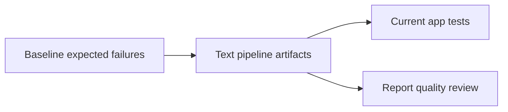

# Testing Guide

## Test Strategy

The pipeline itself is a text instruction hierarchy, so verification focuses on
the sample app behavior and the required artifact contract.

## Command Matrix

Run commands from the repository root.

| Command | Expected Result |
| --- | --- |
| `node --test --test-isolation=none homework-4/app/current/tests/*.test.js` | Passes for the fixed app. |
| `node --test --test-isolation=none homework-4/app/baseline/tests/*.test.js` | Fails for the seeded baseline defects. |
| `node homework-4/app/current/src/cli.js --item WIDGET:2 --item GADGET:1 --discount SAVE10` | Prints a fixed quote. |

## Artifact Review Checklist

- `skills/pipeline-harness-wrapper.md` contains the canonical launch intent.
- `adapters/codex-chat.md`, `adapters/claude-code.md`, `adapters/open-code.md`,
  `adapters/google-antigravity.md`, and `adapters/generic-agent.md` exist.
- All four required agents exist and name their inputs and outputs.
- Research verifier references `skills/research-quality-measurement.md`.
- Unit test generator references `skills/unit-tests-FIRST.md`.
- `benchmark/bug-001/runs/` contains normalized benchmark metadata, copied
  source reports, and any benchmark-owned repaired artifacts for all six runs.
- Source snapshots under `runs/bug-001/` remain immutable after comparison.
- `run-metadata.json` identifies adapter `codex-chat`.
- Future `run-metadata.json` files include `runtimeSubagentAudit`.
- `runtimeSubagentAudit.collectionMode` is `native-hook`, `plugin-event`,
  `adapter-recorded`, or `manual-unavailable`.
- Each future stage has observed runtime evidence or a clear unavailable or
  not-used note.
- Existing source and benchmark snapshots are not rewritten for the runtime
  audit contract.

## Current App Coverage

Current app tests cover:

- multiplication-based line totals;
- percentage-based `SAVE10`;
- catalog traversal rejection;
- generated regression coverage for combined total/discount behavior.

## Baseline Failure Evidence

The baseline command is expected to return a nonzero exit code. That result
proves the input app still contains the intentional defects that the pipeline is
meant to fix.
