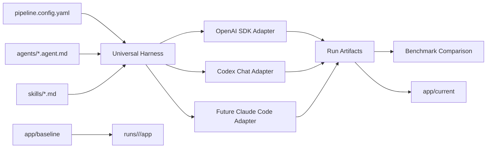

# Homework 4 Agentic Pipeline Design

> Superseded on 2026-05-22 by `2026-05-22-pure-agentic-pipeline-design.md`.
> This earlier design kept a useful staged-agent architecture, but it over-scoped
> the homework by treating JavaScript harnesses and SDK adapters as the primary
> execution proof. The current submission is text-first: one chat phrase launches
> the agent hierarchy, and portable adapters are Markdown instructions.

## Purpose

Homework 4 asks for a four-agent pipeline that can verify bug research, apply fixes, review security, and generate unit tests. This design turns that assignment into a portable, reproducible agentic workflow rather than a set of one-off prompt files. The implementation will preserve the intentionally buggy application, keep every adapter and model run isolated, promote one verified fixed application for final submission, and compare previous runs as a small benchmark.

The assignment's expected structure block says `homework-5/`, but the actual task file is `homework-4/TASKS.md` and the active branch is `homework-4-submission`. All implementation belongs under `homework-4/`.

## Goals

- Provide the four required agent specifications:
  - Bug Research Verifier
  - Bug Fixer
  - Security Vulnerabilities Verifier
  - Unit Test Generator
- Add the two required skills:
  - research quality measurement
  - FIRST unit test quality
- Support the task's stated run order, including Bug Researcher and Bug Planner helper stages before the four required agents.
- Provide a small runnable app with at least two intentional bugs and at least one intentional security issue.
- Preserve the buggy input app and the fixed output app separately.
- Make the primary pipeline runnable through one command.
- Support Codex through both an OpenAI SDK adapter and a Codex chat adapter.
- Keep a clean adapter layer so other coding agents, such as Claude Code, can be added without changing the core artifact contract.
- Record adapter, provider, model, reasoning effort, timestamps, commands, and results for every run.
- Generate comparison artifacts from previous runs so different adapters and models can be reviewed as a mini-benchmark.

## Non-Goals

- Do not implement a large production system. The sample app should be intentionally small enough for a single pipeline run.
- Do not make Codex chat the only evidence for single-command execution. The OpenAI SDK adapter is the primary single-command path.
- Do not make vendor-specific agent files the only source of truth. Agent specs and run metadata should be portable.
- Do not let adapter runs overwrite each other or overwrite the immutable baseline.
- Do not modify previous homework folders as part of Homework 4.

## Architecture

Homework 4 will use a universal harness with adapter-specific execution layers.



The harness owns deterministic concerns: loading manifests, copying the baseline app into isolated workspaces, validating output files, generating diffs, promoting a selected run, and aggregating benchmark results. Adapters own model interaction: how an agent prompt is executed, which model is used, and how model output is converted into the normalized artifact shape.

## Directory Model

The planned final structure is:

```text
homework-4/
├── app/
│   ├── baseline/
│   └── current/
├── agents/
├── skills/
├── scenarios/
│   └── bug-001/
├── pipeline/
├── adapters/
├── runs/
│   └── bug-001/
│       └── run-001/
├── benchmark/
├── docs/
│   ├── screenshots/
│   └── superpowers/
│       ├── specs/
│       └── plans/
├── README.md
├── HOWTORUN.md
├── API_REFERENCE.md
├── ARCHITECTURE.md
├── TESTING_GUIDE.md
├── CHANGELOG.md
└── TASKS.md
```

`app/baseline` is immutable after the seeded bugs are established. `app/current` is the final working application promoted from the selected best verified run. Every adapter/model attempt writes to `runs/<scenario>/<run-id>/` and does not edit either baseline or current directly.

## Sample App Strategy

Use a small Node.js CLI application so the assignment can be run with `npm` and tested without external services. The intended app is a quote or invoice calculator with a tiny product catalog.

Seeded defects:

- Logic bug 1: line totals use addition instead of multiplication for quantity and price.
- Logic bug 2: a percentage discount code applies a flat subtraction instead of a percentage.
- Security issue: catalog file selection allows path traversal instead of constraining names to an approved catalog directory.

The baseline should include tests or verification scripts that prove the intended behavior is currently broken. A dedicated baseline verification command should exit successfully only when the seeded failures are reproduced, so reviewers can see that the pipeline had real issues to fix.

## Agent Pipeline

The assignment requires four agents and names a longer run order. The implementation should use six stages:

1. Bug Researcher helper stage
2. Bug Research Verifier required agent
3. Bug Planner helper stage
4. Bug Fixer required agent
5. Security Vulnerabilities Verifier required agent
6. Unit Test Generator required agent

The helper stages satisfy the run-order language in `TASKS.md`. The four required agents remain the primary deliverables.

Each `agents/*.agent.md` file should use portable frontmatter:

```yaml
id: bug-fixer
role: implementation
model_policy: implementation-medium
reasoning_effort: medium
inputs:
  - scenarios/bug-001/implementation-plan.md
outputs:
  - fix-summary.md
skills: []
allowed_actions:
  - read
  - edit-run-workspace
  - test
```

Exact provider model names belong in model policy configuration and run metadata, not only inside prose. This keeps the agent specs reusable across OpenAI SDK, Codex chat, Claude Code, and other coding agents.

## Adapter Strategy

### OpenAI SDK Adapter

The OpenAI SDK adapter is the primary single-command implementation. It should be runnable through `npm run pipeline` or an explicit `npm run pipeline:openai` command. It reads the universal manifest, loads agent specs and skills, invokes the configured model, applies file writes inside the isolated run workspace, runs verification commands, and writes normalized artifacts.

### Codex Chat Adapter

The Codex chat adapter is a documented and validated workflow for this Codex environment. It prepares prompt packets and a skill invocation guide, then validates that a chat-assisted run produced the same artifact shape. It is useful for screenshots and workflow evidence, but it should be described as a chat adapter rather than the primary proof of single-command execution.

### Future Claude Code Adapter

Claude Code can be documented as a future or optional adapter because its subagent and headless command model fits the assignment style. The first Homework 4 implementation should not depend on Claude Code being installed locally. If added later, it should consume the same manifest and produce the same `runs/<scenario>/<run-id>/` outputs.

## Run Artifact Contract

Every run is identified by scenario and run id:

```text
runs/<scenario>/<run-id>/
├── run-metadata.json
├── app/
├── patch.diff
├── research/
│   └── verified-research.md
├── fix-summary.md
├── security-report.md
├── test-report.md
├── command-log.md
└── raw-responses/
```

`run-metadata.json` must include:

- run id
- scenario id
- adapter
- provider
- model
- reasoning effort
- pipeline version
- baseline commit
- start and end timestamps
- status
- pipeline command
- test command
- metrics
- manual interventions
- promoted flag

Metrics should include bugs fixed, security issues fixed, tests added, tests passing, duration, and manual intervention count.

## Benchmark Strategy

The benchmark is intentionally lightweight. It compares previous run artifacts rather than claiming statistically rigorous model evaluation.

Scoring categories:

- Correctness: 40 points
- Security remediation: 25 points
- Test quality: 15 points
- Maintainability and minimality: 10 points
- Reproducibility and autonomy: 10 points

The comparison step reads run metadata, test reports, security reports, and patches. It writes:

- `benchmark/bug-001-results.json`
- `benchmark/bug-001-comparison.md`
- `benchmark/scoring-rubric.md`

Only completed runs with valid metadata should appear in scored comparison tables. Unsupported or planned adapters may be documented separately but should not be scored.

## Verification Strategy

Verification should prove both input and output states:

- Baseline verification confirms the seeded bugs and security issue exist.
- Pipeline verification confirms required reports and run metadata are produced.
- Current app verification confirms the promoted fixed app passes tests.
- Adapter validation confirms a run follows the artifact contract.
- Benchmark verification confirms comparison files are generated from run data.

Runtime tests are intentionally not part of Phase 0. They begin when the sample app and harness are implemented.

## Constraints And Safety Rules

- Keep all Homework 4 implementation under `homework-4/`.
- Do not edit previous homework folders.
- Do not let adapters write outside the isolated run app workspace.
- Keep `app/baseline` immutable after seeded bugs are established.
- Promote into `app/current` only from a verified run.
- Record unavailable credentials or unavailable adapters honestly in reports and documentation.
- If the OpenAI API key is unavailable, build a deterministic mock adapter for harness verification and mark live SDK execution as blocked until credentials are supplied.

## Starter Message For Future Implementation Thread

```text
We are on branch homework-4-submission in C:\Work\Codex\SETU-HW\gen-ai-se-hw.

Continue Homework 4 after Phase 0. Read these files first:
1. AGENTS.md
2. HOMEWORK_STANDARDS.md
3. homework-4/TASKS.md
4. homework-4/docs/superpowers/specs/2026-05-21-agentic-pipeline-design.md
5. homework-4/docs/superpowers/plans/2026-05-21-homework-4-agentic-pipeline.md
6. homework-4/CHANGELOG.md

Do not modify previous homework folders. Implement the next approved phase only, update homework-4/CHANGELOG.md in the same step, and run the verification commands listed in the plan for that phase.
```
