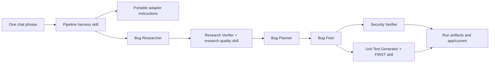

# Homework 4 Pure Agentic Pipeline Design

## Purpose

Homework 4 is a four-agent bug-fixing pipeline. The corrected goal is
`Ціль запустити одним промптом усі інші`: one prompt in an agentic coding chat
starts the rest of the pipeline. This design keeps the staged architecture,
portable agent specs, run artifacts, and comparison rubric from the first
attempt, but removes executable harness and adapter scripts.

## Goals

- Launch the full pipeline from one short Codex chat phrase, such as
  `Run HW4 pipeline`.
- Trigger the wrapper from user intent, not exact phrase matching.
- Keep the four required agents and two helper stages in the assignment order:
  Bug Researcher, Bug Research Verifier, Bug Planner, Bug Fixer, Security
  Verifier, Unit Test Generator.
- Keep the required skills for research quality and FIRST unit tests.
- Preserve the intentionally buggy app and the fixed app as concrete evidence.
- Preserve run artifacts and benchmark-style comparison as text evidence.
- Make the same instruction hierarchy portable to Claude Code, Open Code,
  Google Antigravity, and a generic capable-agent fallback without requiring
  scripts for those tools.

## Non-Goals

- Do not maintain a Node.js harness, SDK adapter, mock adapter, promotion script,
  or benchmark generator.
- Do not make `npm run pipeline` or any shell script the proof of execution.
- Do not remove the sample app JavaScript or app tests; they are the assignment
  target, not the pipeline implementation.
- Do not add new provider-specific code for Claude Code, Open Code, Google
  Antigravity, or generic fallback execution.

## Architecture



The harness is a Markdown skill. It tells the active coding assistant which
files to load, what order to run the agents in, where artifacts must be written,
which actions are allowed, and when to stop. The active tool chooses its own
dedicated adapter in the happy path; adapter documents translate that same
contract into each tool's language.

## Directory Model

```text
homework-4/
├── adapters/                  # Markdown adapter instructions only
├── agents/                    # Portable agent specs
├── app/
│   ├── baseline/              # intentionally buggy input app
│   └── current/               # fixed app promoted from the canonical run
├── benchmark/                 # manually reviewed text comparison artifacts
├── docs/
│   └── superpowers/
├── runs/bug-001/codex-chat-gpt-5.4-run-001/
│                                # canonical completed text-pipeline run
├── scenarios/bug-001/         # bug context, research, and plan inputs
├── skills/                    # pipeline harness, runner, and required skills
└── README.md / HOWTORUN.md / API_REFERENCE.md / ARCHITECTURE.md / TESTING_GUIDE.md
```

## Run Contract

Every completed run keeps this artifact shape:

- `run-metadata.json`
- `app/`
- `patch.diff`
- `research/verified-research.md`
- `implementation-plan.md`
- `fix-summary.md`
- `security-report.md`
- `test-report.md`
- `command-log.md`

Run folders use `<adapter>-<primary-model>-<run-id>` so the agentic tool and
model are visible at a glance. The canonical run for this submission is
`runs/bug-001/codex-chat-gpt-5.4-run-001`. Its metadata identifies the
`codex-chat` adapter, selected model, folder name, and launch intent.

## Safety Rules

- Pipeline instructions may edit only the selected run workspace and text
  artifacts unless explicitly promoting to `app/current`.
- `app/baseline` stays intentionally buggy.
- `security-verifier` is read/report only.
- If any required stage cannot write its artifact, the pipeline stops and records
  the blocker in `command-log.md` and `run-metadata.json`.
- Adapter portability is maintained through Markdown instructions, not scripts.

## Verification

Verification is manual and transparent:

- Run `node --test --test-isolation=none homework-4/app/current/tests/*.test.js`
  to prove the fixed app passes.
- Run `node --test --test-isolation=none homework-4/app/baseline/tests/*.test.js`
  to prove the baseline still exposes the seeded defects.
- Review the run artifact contract and adapter instructions.
- Search for stale script-era claims before final submission.
