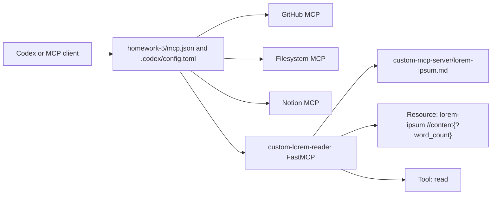

# Homework 5: MCP Servers

Author: Igor Tanatarov

## Overview

This homework configures GitHub, Filesystem, Notion, and custom FastMCP MCP servers. The custom server reads `custom-mcp-server/lorem-ipsum.md` and exposes word-limited content through both an MCP Resource and MCP Tools.



## MCP Configuration

- `mcp.json` is the portable assignment configuration and registers all four required servers: `github`, `filesystem`, `notion`, and `custom-lorem-reader`.
- `.codex/config.toml` is the Codex app project-scoped configuration that was used locally for the verified MCP interactions.
- Credentials are not committed. GitHub uses the `GITHUB_PERSONAL_ACCESS_TOKEN_FOR_MCP` environment variable, and Notion authentication remains in the user's local MCP session.
- The Filesystem MCP path in this local setup points at `C:\Work\Codex\folder-mcp`; reviewers should replace that path with a directory they are allowed to expose.

## Requirement Coverage

| Task | Requirement | Current evidence | Status |
|---|---|---|---|
| Task 1 | Configure GitHub MCP and perform a GitHub interaction | `docs/screenshots/task-1-using-github-mcp-1.png`, `docs/screenshots/task-1-using-github-mcp-2.png` | Done |
| Task 2 | Configure Filesystem MCP and perform a file interaction | `docs/screenshots/task-2-using-filesystem-mcp.png` | Done |
| Task 3 | Configure Jira or Notion MCP and request the last 5 bug tickets/pages | `docs/screenshots/task-3-using-notion-mcp.png` shows Notion MCP availability; `docs/screenshots/task-4-using-custom-mcp-and-notion.png` shows Notion page creation | Partially evidenced: the repo does not currently include a screenshot of the exact "last 5 bugs" request/response |
| Task 4 | Build a custom FastMCP server with Resource, `read` Tool, dependency, source file, docs, and evidence | `custom-mcp-server/server.py`, `custom-mcp-server/lorem-ipsum.md`, `custom-mcp-server/requirements.txt`, `docs/screenshots/custom-mcp-codex-read-lorem-ipsum-result.png`, `docs/screenshots/custom-mcp-codex-validation-result.png`, `docs/screenshots/task-4-using-custom-mcp-and-notion.png` | Done |

## Custom FastMCP Server

- Resources are URIs that Claude can read from, such as files, APIs, or generated content.
- Tools are actions Claude can call to perform operations, such as reading a file or running a command.
- The custom Resource is `lorem-ipsum://content{?word_count}`, documented for reviewers as equivalent to `GET /lorem-ipsum?word-count={count}`.
- The assignment-facing custom Tool is `read`.
- The previous `read_lorem_ipsum` Tool remains available as a compatibility alias for existing screenshots and local evidence.

Both Resource and Tool paths use the same validation helper. If `word_count` is omitted or blank, the server returns 30 words. If `word_count` is a valid non-negative integer within the source length, it returns exactly that many whitespace-delimited words. Negative numbers, decimal values, non-numeric strings, booleans, and values larger than the source text fail with a clear validation error.

## Screenshot Evidence

- `docs/screenshots/listing-mcp-servers.png` - MCP server listing showing GitHub, Filesystem, Notion, and custom server availability.
- `docs/screenshots/task-1-using-github-mcp-1.png` - GitHub MCP prompt and branch/PR response evidence.
- `docs/screenshots/task-1-using-github-mcp-2.png` - Additional GitHub MCP branch/PR response and authentication status evidence.
- `docs/screenshots/task-2-using-filesystem-mcp.png` - Filesystem MCP write/read interaction evidence.
- `docs/screenshots/task-3-using-notion-mcp.png` - Notion MCP tools and resources availability evidence.
- `docs/screenshots/task-4-using-custom-mcp-and-notion.png` - Custom Resource result and Notion MCP page creation evidence.
- `docs/screenshots/custom-mcp-codex-read-lorem-ipsum-result.png` - Added by Codex, successful custom MCP tool call evidence from the earlier Task 4 pass.
- `docs/screenshots/custom-mcp-codex-validation-result.png` - Added by Codex, local validation and startup evidence from the earlier Task 4 pass.

## Project Structure

```text
homework-5/
├── .codex/
│   └── config.toml
├── README.md
├── HOWTORUN.md
├── CHANGELOG.md
├── TASKS.md
├── mcp.json
├── custom-mcp-server/
│   ├── server.py
│   ├── lorem-ipsum.md
│   ├── requirements.txt
│   └── test_word_count.py
└── docs/
    ├── screenshots/
    │   ├── listing-mcp-servers.png
    │   ├── task-1-using-github-mcp-1.png
    │   ├── task-1-using-github-mcp-2.png
    │   ├── task-2-using-filesystem-mcp.png
    │   ├── task-3-using-notion-mcp.png
    │   ├── task-4-using-custom-mcp-and-notion.png
    │   ├── custom-mcp-codex-read-lorem-ipsum-result.png
    │   └── custom-mcp-codex-validation-result.png
    └── work-items/
        ├── 2026-06-13-custom-fastmcp-server/
        └── 2026-06-13-homework-5-final-evidence-readme/
```

## Challenge and Takeaway

The custom server can be runnable without being registered as a native Codex tool. A stdio MCP server only becomes available to Codex after Codex loads an active MCP configuration and initializes the server as a child process; starting `python server.py` separately or keeping a portable `mcp.json` nearby is not enough. Codex app project selection also matters: project-scoped MCP servers should live in `.codex/config.toml` under the active project path. For this homework, the scoped Codex config lives at `homework-5/.codex/config.toml`, so a thread started with `homework-5` as the selected project can discover the homework-specific server, while a thread started from a broader project root may not load that nested config. Some registered MCP tools may also appear only after tool discovery rather than in the initial visible tool list.

## Verification

Run the focused checks from the repository root:

```powershell
python -m pytest homework-5\custom-mcp-server\test_word_count.py -q
python -m json.tool homework-5\mcp.json
python -c "import sys; sys.path.insert(0, r'homework-5\custom-mcp-server'); import server; print(server.read(5))"
Select-String -Path homework-5\custom-mcp-server\requirements.txt -Pattern '^fastmcp\b'
```

Reviewer note: Task 3 still needs a screenshot of the exact Notion/Jira request from `TASKS.md` if strict grading requires visible proof of the "last 5 bugs" response rather than general Notion MCP capability and page-creation evidence.
