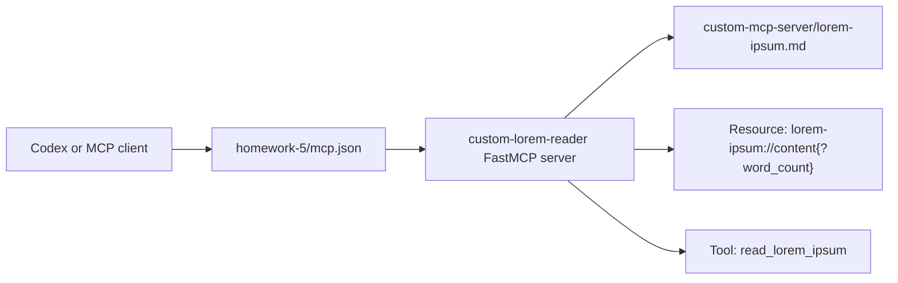

# Homework 5: MCP Servers

Author: Igor Tanatarov

## Overview

This homework configures MCP servers and implements a custom FastMCP server for Task 4. The custom server reads `custom-mcp-server/lorem-ipsum.md` and exposes word-limited content through both an MCP Resource and an MCP Tool.



## Custom FastMCP Server

- Resources are URIs that Claude can read from, such as files, APIs, or generated content.
- Tools are actions Claude can call to perform operations, such as reading a file or running a command.
- The custom Resource is `lorem-ipsum://content{?word_count}`, documented for reviewers as equivalent to `GET /lorem-ipsum?word-count={count}`.
- The custom Tool is `read_lorem_ipsum`.
- The assignment example names the tool `read`; this implementation uses `read_lorem_ipsum` because the approved plan requires an informative matching tool name for portable MCP clients.

Both Resource and Tool paths use the same validation helper. If `word_count` is omitted or blank, the server returns 30 words. If `word_count` is a valid non-negative integer within the source length, it returns exactly that many whitespace-delimited words. Negative numbers, decimal values, non-numeric strings, booleans, and values larger than the source text fail with a clear validation error.

## Evidence

Screenshots marked `Added by Codex` were captured from real local Codex-visible validation or MCP interactions.

- `docs/screenshots/custom-mcp-codex-read-lorem-ipsum-result.png` - Added by Codex, successful `read_lorem_ipsum` MCP tool call evidence.
- `docs/screenshots/custom-mcp-codex-validation-result.png` - Added by Codex, local validation and startup evidence.

## Project Structure

```text
homework-5/
├── .codex/
│   └── config.toml
├── README.md
├── HOWTORUN.md
├── CHANGELOG.md
├── TASKS.md
├── mcp.json
├── custom-mcp-server/
│   ├── server.py
│   ├── lorem-ipsum.md
│   ├── requirements.txt
│   └── test_word_count.py
└── docs/
    ├── screenshots/
    │   ├── custom-mcp-codex-read-lorem-ipsum-result.png
    │   └── custom-mcp-codex-validation-result.png
    └── work-items/
        └── 2026-06-13-custom-fastmcp-server/
```

## Challenge and Takeaway

The custom server can be runnable without being registered as a native Codex tool. A stdio MCP server only becomes available to Codex after Codex loads an active MCP configuration and initializes the server as a child process; starting `python server.py` separately or keeping a portable `mcp.json` nearby is not enough. Codex app project selection also matters: project-scoped MCP servers should live in `.codex/config.toml` under the active project path. For this homework, the scoped Codex config lives at `homework-5/.codex/config.toml`, so a thread started with `homework-5` as the selected project can discover the homework-specific server, while a thread started from a broader project root may not load that nested config. Some registered MCP tools may also appear only after tool discovery rather than in the initial visible tool list.

## Verification

Run the focused checks from the repository root:

```powershell
python -m pytest homework-5\custom-mcp-server\test_word_count.py -q
python -m json.tool homework-5\mcp.json
Select-String -Path homework-5\custom-mcp-server\requirements.txt -Pattern '^fastmcp\b'
```
