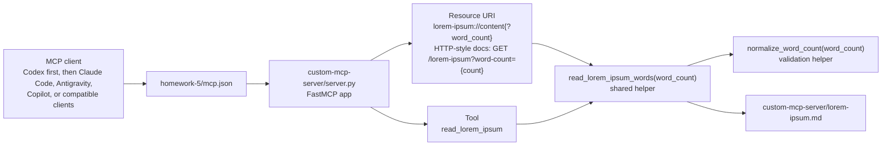

# Architecture Snapshot: Custom FastMCP Server

Work ID: `2026-06-13-custom-fastmcp-server`
Short ID: `custom-fastmcp-server`
Status: Draft

## Components

## Design decisions

- Keep the server as a single small Python module because the homework scope is one Resource, one Tool, and one source file.
- Use one shared helper for Resource and Tool behavior so word-count semantics are identical.
- Use explicit validation for query and tool input so negative numbers, decimals, non-numeric strings, booleans, and counts larger than the source length fail clearly.
- Read `lorem-ipsum.md` with `Path(__file__).with_name(...)` so the server is stable even when the MCP client starts it from a different working directory.
- Use whitespace-delimited word counting because the assignment asks for words, not model tokens or natural-language parsing.
- Include `fastmcp` in `requirements.txt` under the custom server folder to make the dependency explicit and local to the deliverable.
- Verify the MCP server in Codex first, then document portable configuration notes for other MCP-capable clients.
- Store real screenshot evidence under `homework-5/docs/screenshots/`, matching the assignment structure, and mark Codex-created screenshots as `Added by Codex`.

## Control flow

1. The MCP client reads the homework MCP configuration.
2. The client starts `custom-mcp-server/server.py` with Python.
3. FastMCP registers the Resource URI and `read_lorem_ipsum` Tool.
4. A Resource read or Tool call passes a `word_count` value, defaulting to 30 when omitted.
5. `normalize_word_count` validates query or tool input and returns an integer count.
6. `read_lorem_ipsum_words` loads `lorem-ipsum.md`, splits on whitespace, slices to `word_count`, and joins the result.
7. The server returns the word-limited content to the MCP client or returns a clear validation error for invalid input.

## Security and privacy notes

- No credentials are needed for the custom server.
- The server should read only the local `lorem-ipsum.md` file.
- Screenshots should show real Codex-visible MCP or validation behavior without exposing tokens or unrelated machine details.

## Known constraints

- The plan uses FastMCP query-parameter Resource syntax for `word_count` so the default can apply when the parameter is omitted.
- Documentation maps this to the reviewer-friendly `GET /lorem-ipsum?word-count={count}` pattern while preserving the Python-compatible `word_count` implementation name.
- MCP client configuration fields can vary by client; `HOWTORUN.md` must state the verified client and config shape.
- The final all-four-server `mcp.json` may later need entries for GitHub, Filesystem, and Jira or Notion; that is outside this Task 4 implementation plan unless the operator expands scope.
