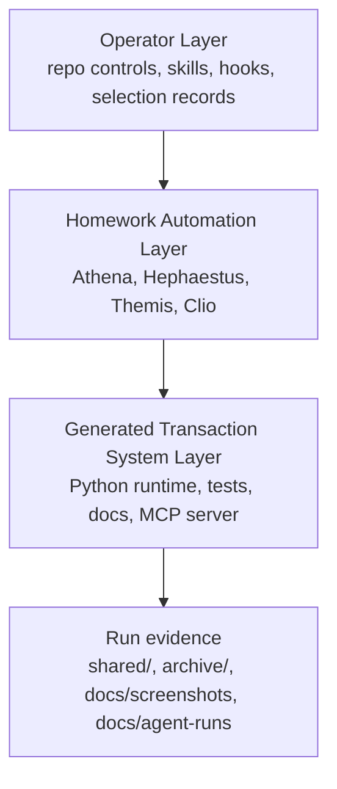
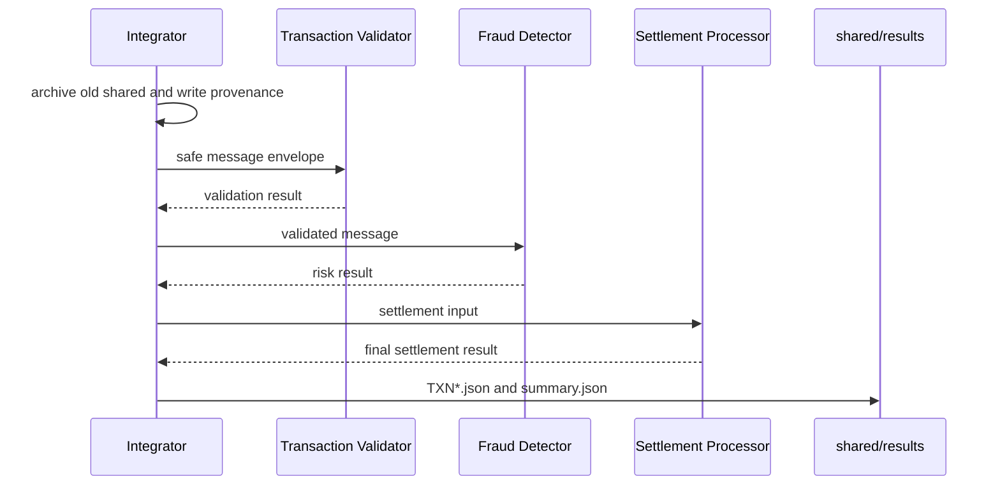
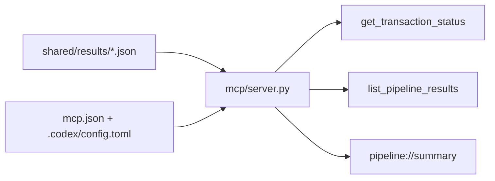

# Architecture

Homework 6 has three explicit layers. Keeping them separate prevents the generated transaction system from depending on hidden agent state or repository maintenance tools.

## Layer Model



| Layer | Responsibility |
|---|---|
| Operator Layer | Maintains control packages, command wrappers, MCP config, hooks, selection records, changelog, and final submission flow. |
| Homework Automation Layer | Produces the selected specification, code, tests, and documentation packages. |
| Generated Transaction System Layer | Runs the deterministic transaction-processing simulation and exposes safe status readers. |

## Selected Source Versions

| Source | Selected run |
|---|---|
| Athena (Spec Writer) | `20260619-170102-write-spec-python-fresh` |
| Hephaestus (Code Generator) | `20260619-175211-generate-code-python-fresh-spec` |
| Themis (Test Generator) | `20260620-144025-generate-tests-python-fresh-spec` |
| Clio (Documentation Generator) | `20260620-230201-generate-docs-python-primary` |

The current canonical specification fingerprint is:

```text
44FD7EF6AC4FEE8070A23820DD784AA6215795D58AE3D7EB8225EFEFB8AB9E3B
```

## Runtime Component Flow



The integrator keeps processing even when one transaction fails. Controlled per-transaction failures become safe `error` results with reason codes and no stack traces.

## File Protocol

```text
shared/
  input/
    001-TXN001.json
  processing/
    001-TXN001-transaction-validator.json
  output/
    001-TXN001-fraud-detector.json
    001-TXN001-settlement-processor.json
  results/
    TXN001.json
    summary.json
    pipeline-status.json
  run-provenance.json
```

Before each normal run, an existing `shared/` folder is copied to the next available archive folder such as `archive/shared-001`.

## Runtime Components

| Component | File | Key behavior |
|---|---|---|
| Integrator | `integrator.py` | Creates protocol directories, archives prior runs, loads sample transactions, writes provenance, invokes runtime components, writes result and summary files. |
| Common utilities | `agents/common.py` | Provides `Decimal` parsing, strict JSON writes, redaction, audit event creation, message envelopes, and sensitive-field assertions. |
| Transaction Validator | `agents/transaction_validator.py` | Validates required fields, positive amount strings, supported currency codes, timestamp shape, and validation-only dry-run summaries. |
| Fraud Detector | `agents/fraud_detector.py` | Applies deterministic educational risk scoring for high value, wire transfer, odd hour, remote channel, mobile channel, and cross-country review signals. |
| Settlement Processor | `agents/settlement_processor.py` | Converts validation and risk outcomes into final statuses and safe final result payloads. |
| Pipeline Status MCP | `mcp/server.py` | Reads current result files through safe tools/resources without rerunning or mutating the pipeline. |

## Privacy And Audit Design

The runtime treats account identifiers, descriptions, metadata, and audit details as sensitive. Public outputs and documentation use only safe fields such as transaction ID, amount string, currency, status, reason codes, risk level, counts, and simulation notices.

Audit events include timestamp, component name, transaction ID, outcome, and optional reason code or risk level. Final results and MCP responses do not expose raw account IDs or descriptions.

## Money And Currency

- Amounts are parsed from strings with `decimal.Decimal`.
- Binary floating point is not used for money comparisons or serialization.
- Valid currencies are `USD`, `EUR`, and `GBP`.
- Unsupported or malformed currency values are rejected with stable reason codes.

## MCP Architecture



`pipeline-status` is read-only. It returns safe status views and does not run `integrator.py`.

## Selection And Preservation

Major automation outputs are preserved under `docs/agent-runs/` before any canonical copy. Selection records identify which run produced the canonical specification, code, tests, and documentation. Runtime folders such as `shared/`, `archive/`, `.coverage*`, `.pytest_cache/`, and `tmp/` are evidence or tool outputs, not selectable product packages.

## Known Limitations

- This is a local educational simulation, not a real payment or compliance system.
- `mcp/server.py` imports can conflict with the installed third-party `mcp` package in one-off Python commands; tests use file-path loading where needed.
- The stable screenshots come from operator-sourced evidence. Some screenshots show earlier 41-test output, while fresh Clio evidence shows the current 50-test suite.
- The file protocol is deterministic and simple by design; it is not a concurrent queue or distributed workflow engine.
