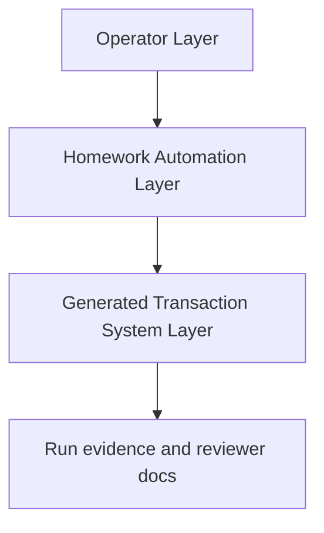
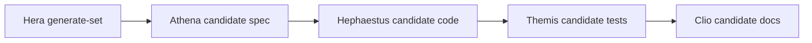
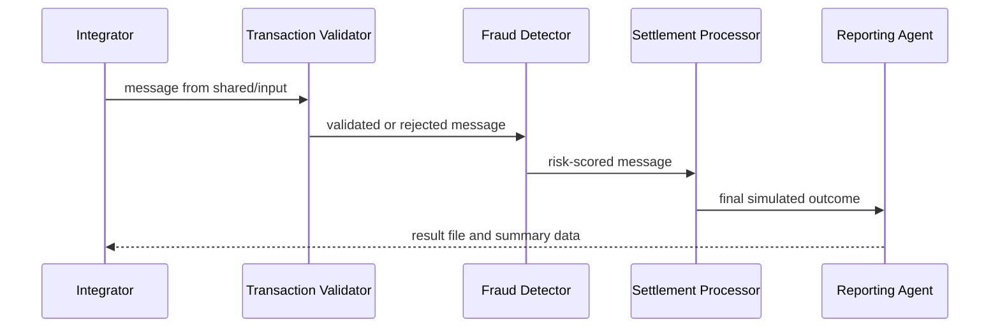

# Architecture

This document describes the selected canonical Python package generated through Hera package-set review. The selected package is copied to the homework root, while the source runs and historical alternates remain preserved under `docs/agent-runs/`.

## Layered View



| Layer | Responsibility in this candidate |
|---|---|
| Operator Layer | Maintains support surfaces such as `agent-control/`, `scripts/check_coverage_gate.py`, `.githooks/pre-push`, `mcp.json`, `.codex/config.toml`, and selection records. |
| Homework Automation Layer | Hera coordinates Athena, Hephaestus, Themis, and Clio package-set runs and records explicit selections. |
| Generated Transaction System Layer | Canonical Python runtime pipeline, tests, result files, and safe MCP-readable result shapes. |

## Selected Package Set



The selected source set is:

- Athena (Spec Writer): `20260621-220037-write-spec-python-hera-python-full-set`
- Hephaestus (Code Generator): `20260621-222543-generate-code-python-hera-python-full-set`
- Themis (Test Generator): `20260621-224632-generate-tests-python-hera-python-full-set`
- Clio (Documentation Generator): `20260621-225923-generate-docs-python-hera-python-full-set`

`docs/agent-runs/selection-sets.json` names `python-canonical-20260622-hera-full-set` as the canonical package set. The earlier Python canonical set remains historical evidence, and Java package set `java-candidate-20260621-180512` remains an alternate stack candidate rather than a root replacement.

## Runtime Component Flow



The runtime components are normal Python modules. They are not Codex skills, Claude commands, or Homework Automation Layer agents.

## JSON File Protocol

The generated product uses the required protocol:

```text
shared/
  input/
  processing/
  output/
  results/
```

The Integrator prepares these folders, archives prior output under `archive/shared-###`, seeds one message per transaction, and verifies that every input has a final result.

## Runtime Components

| Component | File | Main behavior |
|---|---|---|
| Integrator | `integrator.py` | Prepares folders, loads sample records, runs each component, handles per-record errors, and writes provenance. |
| Transaction Validator | `agents/transaction_validator.py` | Validates fields, timestamps, supported currency, and positive `Decimal` amount values. |
| Fraud Detector | `agents/fraud_detector.py` | Applies deterministic educational review signals for high value, unusual time, channel/type, and destination patterns. |
| Settlement Processor | `agents/settlement_processor.py` | Settles low-risk validated records and preserves rejected or review-required records. |
| Reporting Agent | `agents/reporting_agent.py` | Writes safe per-transaction results, aggregate summary, status file, and privacy checks. |

## Privacy And Audit Design

The candidate records safe evidence only:

- Transaction IDs are allowed for traceability.
- Reason codes are used for explanations.
- Amounts are string-serialized.
- Counts and statuses are preferred for summaries.
- Raw account IDs, descriptions, credentials, tokens, and full metadata are excluded from evidence and reviewer docs.

Audit events are runtime component records with timestamp, component name, transaction ID, safe outcome, and optional reason code.

## MCP Design

The root support server `mcp/server.py` exposes:

- Tool `get_transaction_status(transaction_id: str)`
- Tool `list_pipeline_results()`
- Resource `pipeline://summary`

The server reads result files and does not run the pipeline. Before selection, Clio validated helper functions against candidate result files by passing an explicit result directory. After selection, the subprocess form in `mcp.json` reads root `shared/results/`, which matches the canonical root package.

## Stack-Aware Support

The root runtime is Python. The Operator Layer support surfaces also understand a preserved Java package set:

- Python canonical commands use `python integrator.py`, `python -m pytest`, and `python scripts/check_coverage_gate.py --stack python --fail-under 80`.
- Java alternate evidence uses Maven, JUnit, JaCoCo, Jackson, and `BigDecimal`, with stack-aware coverage support through `python scripts/check_coverage_gate.py --stack java --project-dir <java-package> --fail-under 80`.
- Historical Python and Java package runs are evidence snapshots. They are not runtime dependencies of the selected Generated Transaction System Layer.

## Known Limitations

- Historical preserved runs may have different specification fingerprints; the selected root package uses Athena run `20260621-220037-write-spec-python-hera-python-full-set`.
- The runtime is local and file-based, not a concurrent service or durable queue.
- The archival implementation in the candidate was validated as preservation behavior in the sandbox, with Hephaestus noting copy-based archival constraints.
- Hook helper pass/fail behavior is validated; direct hook-shell execution was blocked by the Windows sandbox.
- Stable screenshots are generated terminal-style evidence PNGs, with the full operator-sourced screenshot set preserved under `docs/screenshots/operator-sourced/`.
