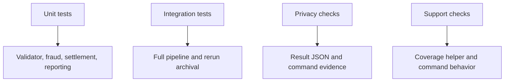

# Testing Guide

This guide documents the selected Themis suite and fresh Clio validation evidence for the Hera-dispatched Python package set now copied to the canonical homework root.

## Test Strategy

The Themis selection extends Hephaestus baseline tests with quality checks across:

- Validator field, currency, amount, audit, and validation-only behavior.
- Fraud scoring for high-value, unusual-time, channel, type, and destination-pattern cases.
- Settlement status preservation and unknown-status handling.
- Reporting result shapes, summary consistency, privacy checks, and error result behavior.
- Integrator setup, provenance, bad-message recovery, full-pipeline results, and archival.
- Operator support behavior for `/run-pipeline`, `/validate-transactions`, and coverage gate pass/fail paths.

## Commands

| Purpose | Command | Fresh Clio result |
|---|---|---|
| Run tests | `python -m pytest -p no:cacheprovider` | 36 passed |
| Coverage gate | `python scripts\check_coverage_gate.py --stack python --fail-under 80` | Passed, 97.44% total coverage |
| Blocking demonstration | `python scripts\check_coverage_gate.py --stack python --fail-under 99` | Expected failure, 97.44% below 99% |
| Pipeline support | documented `/run-pipeline` fast path | 8 results, all present |
| Validation-only support | validator dry-run helper | total 8, valid 6, invalid 2 |

Post-selection root validation also passed with 52 tests and 95.57% total coverage. The larger root count includes Operator Layer support-surface tests for the coverage helper and MCP server in addition to the selected generated package tests.

## Coverage Summary

| Area | Coverage |
|---|---:|
| `agents/__init__.py` | 100% |
| `agents/common.py` | 98% |
| `agents/fraud_detector.py` | 96% |
| `agents/reporting_agent.py` | 100% |
| `agents/settlement_processor.py` | 100% |
| `agents/transaction_validator.py` | 98% |
| `integrator.py` | 88% |
| Total | 97.44% |

## Expected Sample Outcomes

| Transaction | Expected status | Safe reason signal |
|---|---|---|
| `TXN001` | `settled` | `SETTLED` |
| `TXN002` | `review_required` | `REVIEW_HIGH_VALUE` |
| `TXN003` | `review_required` | `REVIEW_DESTINATION_PATTERN` |
| `TXN004` | `review_required` | `REVIEW_UNUSUAL_TIME`, `REVIEW_CHANNEL_PATTERN` |
| `TXN005` | `review_required` | `REVIEW_HIGH_VALUE` |
| `TXN006` | `rejected` | `UNSUPPORTED_CURRENCY` |
| `TXN007` | `rejected` | `NON_POSITIVE_AMOUNT` |
| `TXN008` | `settled` | `SETTLED` |

## Fixture Isolation

The preserved Themis and Clio runs validated the package in run-local workspaces first. After Hera selection, the same test suite is available at the homework root and can be run directly with `python -m pytest -p no:cacheprovider`.

## Multi-Stack Evidence

The canonical suite is Python and reports 36 passing tests with 97.44% total coverage in the selected Clio evidence. A Java package set is preserved separately under `docs/agent-runs/20260621-180512-orchestrate-runs-java-full-set/`; its retry Themis run passed Maven/JUnit/JaCoCo evidence with 13 tests and 87.86% coverage. The Java evidence demonstrates alternate stack availability, while the root test commands remain Python.

## Manual Review Checklist

- Confirm `docs/agent-runs/selection-sets.json` names `python-canonical-20260622-hera-full-set`.
- Run `python integrator.py` and confirm eight results.
- Run pytest and confirm 36 passing tests.
- Run the 80% coverage gate and confirm 97.44% or equivalent above-threshold coverage.
- Run the 99% demonstration threshold and confirm a failing coverage gate signal.
- Open `shared/results/summary.json` and verify counts without exposing raw transaction payloads.
- Use the MCP helper or server after a pipeline run and verify safe status responses.
- Confirm screenshots or capture notes cover pipeline, tests/coverage, command skill, hook, and MCP evidence, and that the full operator-sourced evidence set remains under `docs/screenshots/operator-sourced/`.

## Limitations

Direct shell execution of `.githooks/pre-push` was blocked in the Windows sandbox. The same delegated coverage helper passed at the real 80% threshold and failed at the demonstration 99% threshold, which validates the behavior the hook relies on.
