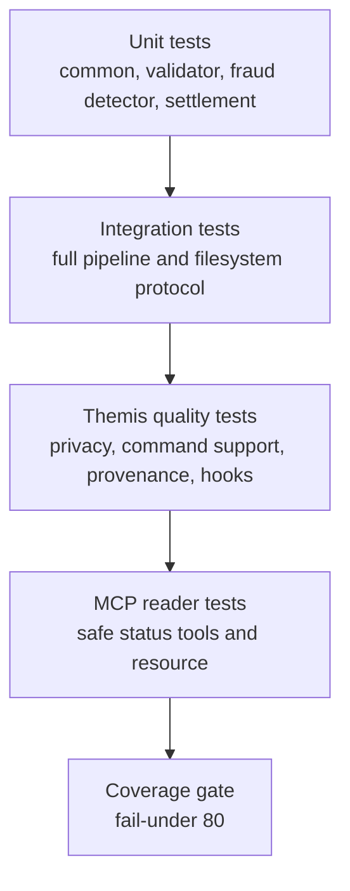

# Testing Guide

The selected Themis (Test Generator) package targets the selected Hephaestus (Code Generator) runtime package and validates both behavior and homework support surfaces.

## Selected Test Package

| Field | Value |
|---|---|
| Themis run | `20260620-144025-generate-tests-python-fresh-spec` |
| Target Hephaestus run | `20260619-175211-generate-code-python-fresh-spec` |
| Selected test inventory | `docs/agent-runs/20260620-144025-generate-tests-python-fresh-spec/agent-3-tests/outputs/inventory.md` |
| Current Clio root evidence | 50 tests passing |
| Current coverage evidence | 94.79% total coverage with 80% gate passing |

## Test Strategy



The suite checks:

- `Decimal` parsing and float rejection.
- Strict JSON serialization and sensitive-field blocking.
- Required field, timestamp, currency, and non-positive amount handling.
- Expected sample outcomes for all eight synthetic transactions.
- Repeated-run archival and provenance creation.
- Validation-only behavior.
- Per-transaction error recovery.
- MCP status helper behavior.
- Coverage gate and hook support surfaces.

## Commands

Run all tests:

```powershell
python -m pytest -p no:cacheprovider
```

Run the coverage gate:

```powershell
python scripts/check_coverage_gate.py --fail-under 80
```

Demonstrate blocking behavior:

```powershell
python scripts/check_coverage_gate.py --fail-under 99
```

Run validation-only evidence:

```powershell
python -c "import json; from collections import Counter; from agents.transaction_validator import validate_transactions_file; r=validate_transactions_file('sample-transactions.json'); safe={'total': r['total'], 'valid': r['valid'], 'invalid': r['rejected'], 'reason_code_groups': dict(Counter(code for item in r['results'] for code in item['reason_codes'])), 'results': [{'transaction_id': item['transaction_id'], 'status': item['status'], 'reason_codes': item['reason_codes']} for item in r['results']]}; print(json.dumps(safe, indent=2))"
```

## Current Evidence

| Check | Result |
|---|---|
| `python integrator.py` | `total=8 settled=2 rejected=2 review_required=4 error=0` |
| `python -m pytest -p no:cacheprovider` | 50 passed |
| `python scripts/check_coverage_gate.py --fail-under 80` | 50 passed, 94.79% total coverage |
| `python scripts/check_coverage_gate.py --fail-under 99` | 50 passed, exits nonzero because 94.79% is below 99% |
| Validation-only command | 8 total, 6 valid, 2 rejected |
| MCP status check | `TXN006` rejected with `UNSUPPORTED_CURRENCY`; summary counts match pipeline output |

The first sandboxed coverage-gate run hit a Windows coverage-file rename permission error. The same command passed unsandboxed, matching the workflow note for Windows coverage-file restrictions.

## Fixture Isolation

Tests use temporary directories for pipeline execution, archival checks, generated JSON files, and coverage helper scratch space. They should not require real `shared/` or `archive/` state to pass.

## Privacy Checks

The tests and documentation check that public outputs avoid:

- Raw account identifiers.
- Raw descriptions.
- Unfiltered metadata dumps.
- Credentials, tokens, or authorization headers.
- Full audit payloads in reviewer-facing summaries.

Safe evidence may include transaction IDs, amount strings, currency codes, statuses, reason codes, risk levels, and aggregate counts.

## Manual QA Checklist

- Run `python integrator.py`.
- Confirm `shared/results/summary.json` has 8 total results.
- Confirm final statuses are limited to `settled`, `rejected`, `review_required`, and `error`.
- Confirm the two validation rejections use `UNSUPPORTED_CURRENCY` and `NON_POSITIVE_AMOUNT`.
- Run `python -m pytest -p no:cacheprovider`.
- Run `python scripts/check_coverage_gate.py --fail-under 80`.
- Optionally run `python scripts/check_coverage_gate.py --fail-under 99` to demonstrate blocking behavior.
- Use the MCP server or file-path helper import to read the latest status summary safely.
