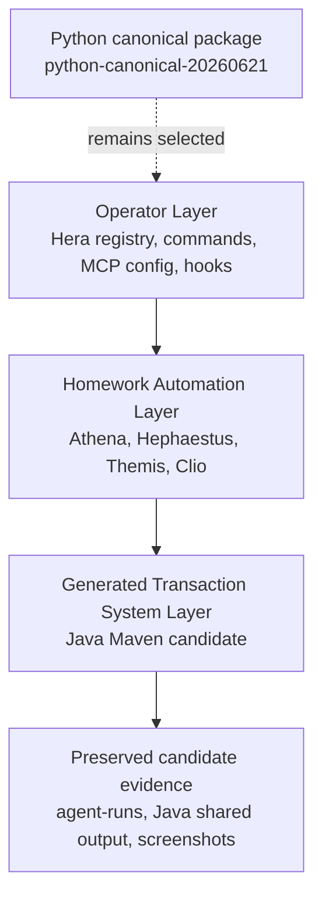
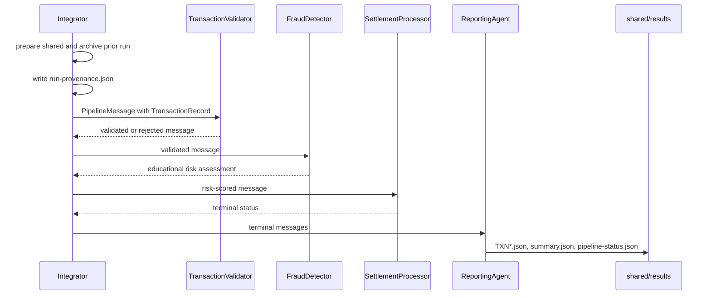
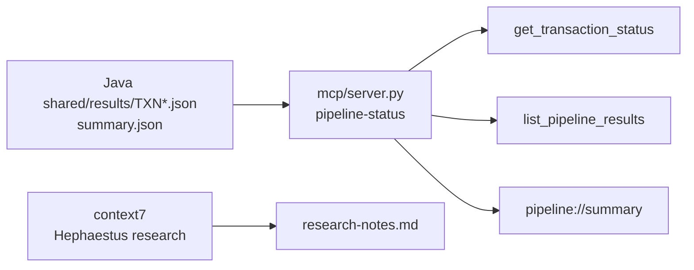

# Java Candidate Architecture

This architecture describes the preserved Java candidate package set `java-candidate-20260621-180512`. It is not the canonical Homework 6 package unless selected later.

## Layer Model



| Layer | Java candidate responsibility |
|---|---|
| Operator Layer | Maintains package-set records, root MCP config, operation commands, hook guidance, and explicit selection boundaries. |
| Homework Automation Layer | Produces preserved Java spec, code, tests, and docs through Athena (Spec Writer), Hephaestus (Code Generator), Themis (Test Generator), and Clio (Documentation Generator). |
| Generated Transaction System Layer | Runs deterministic Java transaction processing with Maven, Jackson, `BigDecimal`, JUnit, JaCoCo, and JSON file outputs. |

## Candidate Source Versions

| Source | Run |
|---|---|
| Athena (Spec Writer) | `20260621-180826-write-spec-java-hera-java-full-set` |
| Hephaestus (Code Generator) | `20260621-183025-generate-code-java-hera-java-full-set` |
| Themis (Test Generator) | `20260621-201051-generate-tests-java-hera-java-full-set-retry` |
| Clio (Documentation Generator) | `20260621-203431-generate-docs-java-hera-java-full-set` |

The Java source spec fingerprint is:

```text
2FC5B597915CFD59D5786271DB0CDE96B06417DEEC1433D056B76D7023234CFC
```

The canonical Python root spec fingerprint remains:

```text
44FD7EF6AC4FEE8070A23820DD784AA6215795D58AE3D7EB8225EFEFB8AB9E3B
```

## Java Runtime Flow



Per-transaction component errors become safe `error` results so unrelated transactions can still complete.

## Maven Project Structure

```text
pom.xml
sample-transactions.json
src/main/java/edu/setu/transactionpipeline/
  Integrator.java
  agent/
    TransactionValidator.java
    FraudDetector.java
    SettlementProcessor.java
    ReportingAgent.java
  cli/
    PipelineOptions.java
    ValidateTransactionsCommand.java
  io/
  model/
  privacy/
src/test/java/edu/setu/transactionpipeline/
```

The Themis retry overlays a candidate `pom.xml` with default 80% coverage and `-Dcoverage.minimum` support for the portable helper.

## Key Technology Choices

| Concern | Choice | Reason |
|---|---|---|
| Build lifecycle | Maven | Standard Java build/test/exec workflow. |
| JSON | Jackson Databind | Strict object mapping and readable file protocol output. |
| Time handling | Jackson Java Time module | ISO-like timestamp serialization for audit and run records. |
| Money | `BigDecimal` | Decimal arithmetic without binary floating point. |
| Tests | JUnit Jupiter | Component and integration tests with temporary workspace support. |
| Coverage | JaCoCo Maven plugin | Enforces the 80% coverage gate for Java. |
| Status inspection | Existing Python FastMCP reader | Reads stack-neutral result JSON without adding a Java MCP server. |

## JSON File Protocol

```text
shared/
  input/
  processing/
  output/
  results/
    TXN001.json
    summary.json
    pipeline-status.json
  run-provenance.json
archive/
  shared-001/
```

The Integrator prepares a fresh `shared/` tree. If one already exists, it is archived before the next run.

## Runtime Component Responsibilities

| Component | Responsibility |
|---|---|
| `Integrator` | Loads input, prepares protocol folders, writes provenance, invokes runtime components, handles safe per-record errors, and returns success only when the summary is complete. |
| `TransactionValidator` | Validates required fields, timestamps, positive amount text parsed as `BigDecimal`, and supported currencies. Invalid records terminate as `rejected`. |
| `FraudDetector` | Adds deterministic educational risk reason codes for high value, very high value, early hours, channel, country, and transfer type. |
| `SettlementProcessor` | Converts validation/risk outcomes to final statuses without money movement or external systems. |
| `ReportingAgent` | Writes privacy-safe result files and aggregate summary/status documents. |
| `PrivacyGuard` | Blocks prohibited sensitive keys or unsafe payloads before public result writes. |

## Privacy And Audit Design

The Java candidate treats account identifiers, descriptions, full metadata, credentials, prompts, and raw audit payloads as sensitive. Review evidence uses transaction IDs, statuses, counts, reason codes, amount strings, currencies, and aggregate summaries.

Audit events include timestamp, component name, transaction ID, outcome, and reason code when applicable. Result files expose counts such as `component_history_count` and `audit_event_count` instead of full internal history payloads.

## MCP Architecture



The Python reader is unchanged in this candidate run. It reads Java result files when they are staged under its configured `shared/results` directory, or when helper functions are invoked directly with a candidate results directory.

## Selection And Preservation

All Java candidate files are preserved under `docs/agent-runs/`. This Clio run writes only under its own run folder. Later Java selection would require explicit Hera authorization and inventory-driven copy from:

```text
docs/agent-runs/20260621-203431-generate-docs-java-hera-java-full-set/agent-4-docs/outputs/inventory.md
```

## Known Limitations

- Java is not currently canonical.
- The Java candidate spec intentionally differs from the selected Python root spec.
- Maven validation used an empty settings/offline workaround in this environment.
- Root operation commands and root MCP tools still default to Python until Java is selected or Java results are staged for inspection.
- Terminal-style screenshots summarize safe evidence; they are not a replacement for a future live Java selection capture if an operator wants one.
