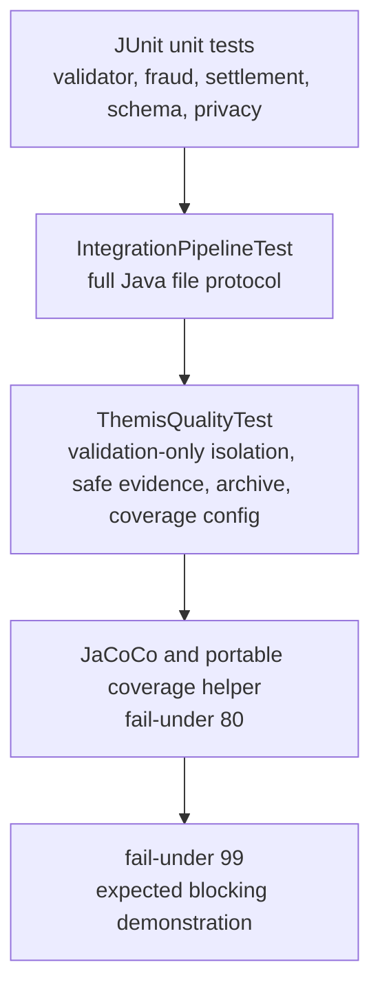

# Java Candidate Testing Guide

This guide documents the usable Themis (Test Generator) retry for the preserved Java candidate. The first Java Themis attempt is blocked and non-selectable.

## Selected Test Package

| Field | Value |
|---|---|
| Themis retry run | `20260621-201051-generate-tests-java-hera-java-full-set-retry` |
| Blocked prior run | `20260621-191017-generate-tests-java-hera-java-full-set` |
| Target Hephaestus run | `20260621-183025-generate-code-java-hera-java-full-set` |
| Target Hephaestus package fingerprint | `248ba67b199104cbe06b4b0869cf3143de85ff1dd88da7bf4a13bc85a58ed883` |
| Selected test package fingerprint | `d75aee1b9e76733d78860348fe26608fef17667a88c25e3c7b416e9150b54922` |
| Test count | 13 |
| JaCoCo instruction coverage | 87.86% |
| Coverage gate | 80% pass, 99% deliberate block |

## Test Strategy



The retry test suite validates:

- Maven build contract and JaCoCo coverage threshold wiring.
- Transaction validation for supported currencies, invalid currencies, and non-positive amounts.
- Fraud scoring and settlement status mapping.
- JSON schema shape for safe Java result files.
- Reporting privacy safeguards.
- Validation-only behavior that does not rerun settlement.
- Repeated-run archive behavior.
- Full pipeline counts for all eight synthetic sample transactions.

## Commands

From the preserved Themis retry workspace:

```powershell
cd docs\agent-runs\20260621-201051-generate-tests-java-hera-java-full-set-retry\agent-3-tests\workspace\project-under-test
```

Run tests and JaCoCo:

```powershell
mvn -o -s ..\maven-empty-settings.xml -gs ..\maven-empty-settings.xml test jacoco:report jacoco:check
```

Run the portable 80% coverage gate:

```powershell
python scripts\check_coverage_gate.py --stack java --project-dir . --maven-settings ..\maven-empty-settings.xml --maven-global-settings ..\maven-empty-settings.xml --fail-under 80
```

Demonstrate blocking behavior:

```powershell
python scripts\check_coverage_gate.py --stack java --project-dir . --maven-settings ..\maven-empty-settings.xml --maven-global-settings ..\maven-empty-settings.xml --fail-under 99
```

Run full pipeline evidence:

```powershell
mvn -o -s ..\maven-empty-settings.xml -gs ..\maven-empty-settings.xml exec:java
```

Run validation-only evidence:

```powershell
mvn -o -s ..\maven-empty-settings.xml -gs ..\maven-empty-settings.xml exec:java '-Dexec.mainClass=edu.setu.transactionpipeline.cli.ValidateTransactionsCommand' '-Dexec.args=sample-transactions.json'
```

## Current Evidence

| Check | Result |
|---|---|
| Maven/JUnit/JaCoCo | 13 tests, 0 failures, JaCoCo check met |
| Instruction coverage | 87.86% |
| Coverage helper `--fail-under 80` | Pass |
| Coverage helper `--fail-under 99` | Expected block |
| Full pipeline | `total=8 settled=2 rejected=2 review_required=4 error=0 complete=true` |
| Validation-only | `total=8 valid=6 invalid=2` |
| Rejected validation IDs | `TXN006`, `TXN007` |
| Privacy scan | Pass |
| Root containment | Pass |

## Fixture Isolation

Themis copied the selected Java code into a run-local workspace and ran validation from:

```text
docs/agent-runs/20260621-201051-generate-tests-java-hera-java-full-set-retry/agent-3-tests/workspace/project-under-test/
```

The selected runtime product files, root tests, root `shared/`, root docs/screenshots, MCP files, and selection records were not modified.

## Command And Hook Validation

The Java candidate supports the shared coverage-helper contract:

```powershell
python scripts\check_coverage_gate.py --stack java --project-dir <java-project> --fail-under 80
```

In this environment, Maven settings override flags were required. The helper correctly passed at 80% and blocked at 99%. This mirrors the pre-push hook behavior expected for selected packages: pass when coverage meets the threshold and block when it does not.

## Privacy Checks

Evidence and generated outputs avoid raw account identifiers, raw descriptions, credentials, tokens, authorization headers, and full audit payloads. Safe evidence includes transaction IDs, statuses, reason codes, amount strings, currency codes, counts, and aggregate summaries.

## Manual QA Checklist

- Confirm this is still a Java candidate, not the canonical Python package.
- Run the Java pipeline command from the preserved workspace.
- Confirm 8 result files and `complete=true`.
- Confirm final statuses are limited to `settled`, `rejected`, `review_required`, and `error`.
- Run validation-only mode and confirm `6` valid and `2` invalid.
- Run Maven tests and JaCoCo.
- Run the coverage helper at `--fail-under 80`.
- Optionally run the helper at `--fail-under 99` to see the deliberate block.
- Inspect Java `shared/results` with the existing Python MCP reader only after staging or pointing helper functions at candidate results.
