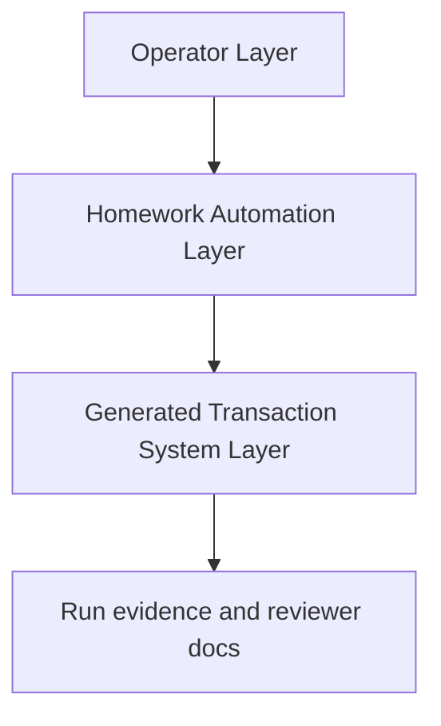
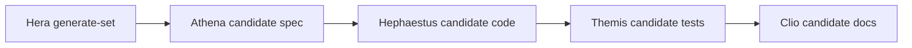
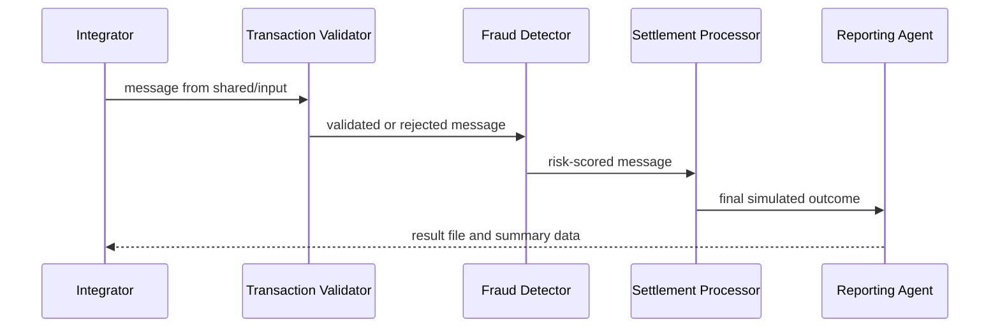

# Architecture

This document describes the fresh Python candidate generated for Hera package-set review. The package is preserved under `docs/agent-runs/` and is not canonical unless a later selection step copies inventory-declared outputs.

## Layered View



| Layer | Responsibility in this candidate |
|---|---|
| Operator Layer | Maintains support surfaces such as `agent-control/`, `scripts/check_coverage_gate.py`, `.githooks/pre-push`, `mcp.json`, `.codex/config.toml`, and selection records. |
| Homework Automation Layer | Hera coordinates Athena, Hephaestus, Themis, and Clio candidate runs. |
| Generated Transaction System Layer | Python runtime pipeline, tests, result files, and safe MCP-readable result shapes. |

## Source Package Set



The candidate source set is:

- Athena (Spec Writer): `20260621-220037-write-spec-python-hera-python-full-set`
- Hephaestus (Code Generator): `20260621-222543-generate-code-python-hera-python-full-set`
- Themis (Test Generator): `20260621-224632-generate-tests-python-hera-python-full-set`
- Clio (Documentation Generator): `20260621-225923-generate-docs-python-hera-python-full-set`

## Runtime Component Flow



The runtime components are normal Python modules. They are not Codex skills, Claude commands, or Homework Automation Layer agents.

## JSON File Protocol

The generated product uses the required protocol:

```text
shared/
  input/
  processing/
  output/
  results/
```

The Integrator prepares these folders, archives prior output under `archive/shared-###`, seeds one message per transaction, and verifies that every input has a final result.

## Runtime Components

| Component | File | Main behavior |
|---|---|---|
| Integrator | `integrator.py` | Prepares folders, loads sample records, runs each component, handles per-record errors, and writes provenance. |
| Transaction Validator | `agents/transaction_validator.py` | Validates fields, timestamps, supported currency, and positive `Decimal` amount values. |
| Fraud Detector | `agents/fraud_detector.py` | Applies deterministic educational review signals for high value, unusual time, channel/type, and destination patterns. |
| Settlement Processor | `agents/settlement_processor.py` | Settles low-risk validated records and preserves rejected or review-required records. |
| Reporting Agent | `agents/reporting_agent.py` | Writes safe per-transaction results, aggregate summary, status file, and privacy checks. |

## Privacy And Audit Design

The candidate records safe evidence only:

- Transaction IDs are allowed for traceability.
- Reason codes are used for explanations.
- Amounts are string-serialized.
- Counts and statuses are preferred for summaries.
- Raw account IDs, descriptions, credentials, tokens, and full metadata are excluded from evidence and reviewer docs.

Audit events are runtime component records with timestamp, component name, transaction ID, safe outcome, and optional reason code.

## MCP Design

The root support server `mcp/server.py` exposes:

- Tool `get_transaction_status(transaction_id: str)`
- Tool `list_pipeline_results()`
- Resource `pipeline://summary`

The server reads result files and does not run the pipeline. In this candidate run, Clio validated the helper functions against candidate result files by passing an explicit result directory. The subprocess form in `mcp.json` reads root result files by default, which is correct for a selected/canonical package and a limitation for unselected candidate evidence.

## Known Limitations

- This package documents a candidate set whose specification fingerprint differs from the current canonical specification.
- The runtime is local and file-based, not a concurrent service or durable queue.
- The archival implementation in the candidate was validated as preservation behavior in the sandbox, with Hephaestus noting copy-based archival constraints.
- Hook helper pass/fail behavior is validated; direct hook-shell execution was blocked by the Windows sandbox.
- Candidate screenshots are generated terminal-style evidence PNGs, not literal in-app browser captures.
