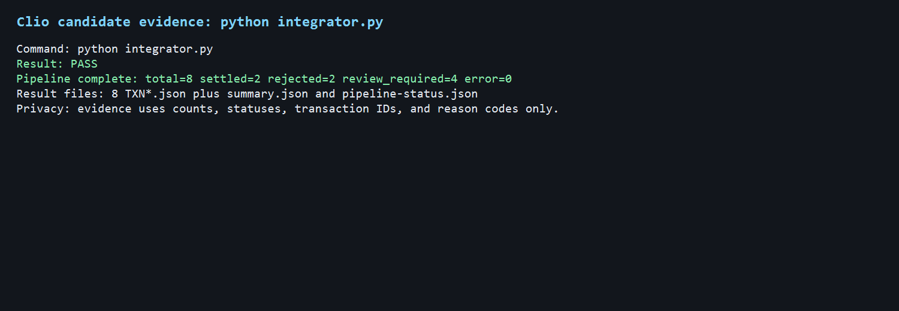
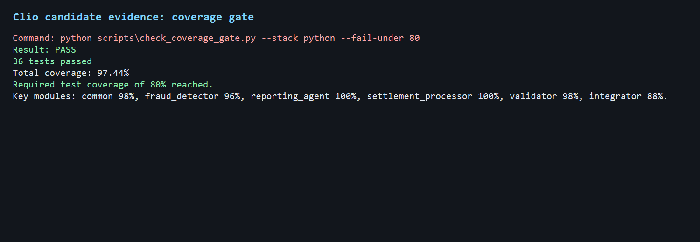
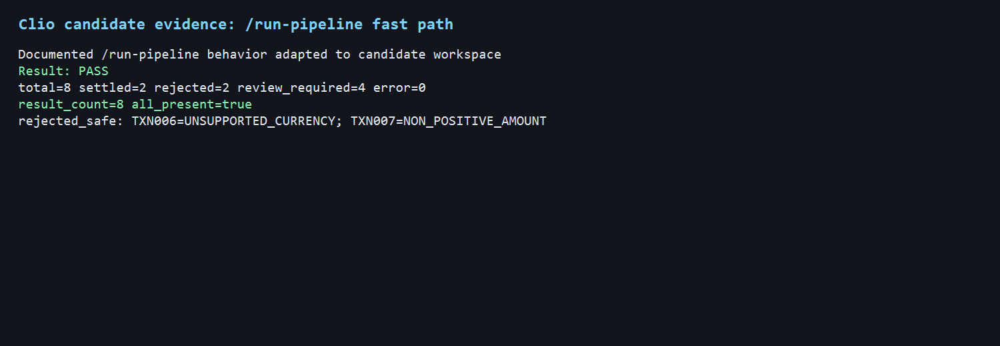
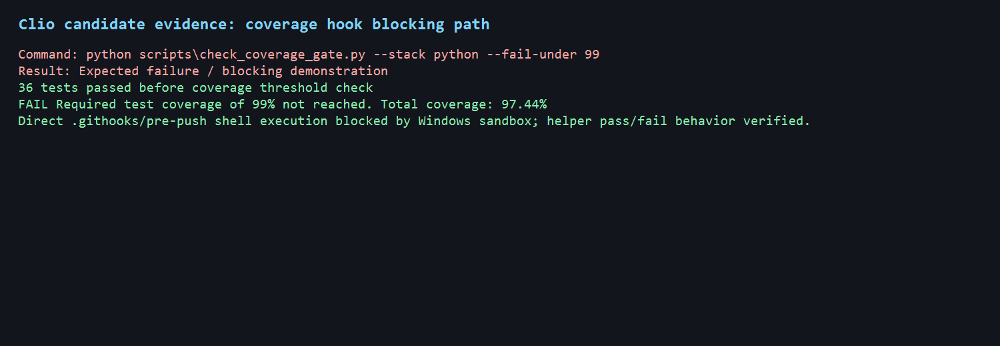
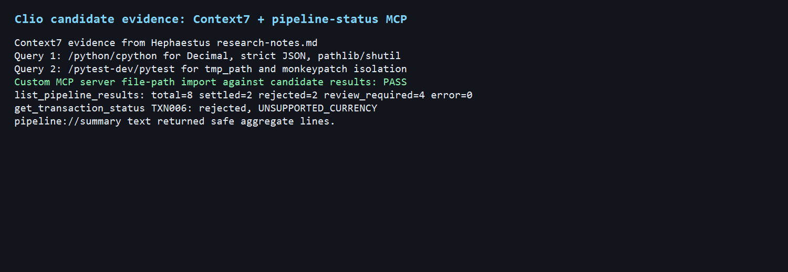

# Homework 6 Fresh Python Candidate PR Draft

## Summary

This package preserves a fresh Python Homework 6 candidate generated through Hera (Orchestrator). It includes documentation for the named Athena (Spec Writer), Hephaestus (Code Generator), and Themis (Test Generator) candidate trio, plus fresh Clio (Documentation Generator) evidence and screenshots.

This is a candidate package for review and comparison. It does not replace the current canonical `python-canonical-20260621` package unless a later explicit selection step copies the inventory-declared files.

## Author

Igor Tanatarov

## AI Workflow

- Hera (Orchestrator) coordinated a `generate-set` run for the Python stack.
- Athena (Spec Writer) produced candidate specification `20260621-220037-write-spec-python-hera-python-full-set`.
- Hephaestus (Code Generator) produced candidate runtime code `20260621-222543-generate-code-python-hera-python-full-set`.
- Themis (Test Generator) produced candidate test expansion `20260621-224632-generate-tests-python-hera-python-full-set`.
- Clio (Documentation Generator) produced this preserved documentation candidate `20260621-225923-generate-docs-python-hera-python-full-set`.
- Hephaestus used Context7 for `/python/cpython` and `/pytest-dev/pytest`, recorded in candidate `research-notes.md`.

## Verification

Fresh Clio validation ran from a temporary candidate workspace built from the Hephaestus package plus the Themis test overlay.

| Check | Result |
|---|---|
| `python integrator.py` | Passed: total 8, settled 2, rejected 2, review-required 4, error 0 |
| `python -m pytest -p no:cacheprovider` | Passed: 36 tests |
| `python scripts\check_coverage_gate.py --stack python --fail-under 80` | Passed: 97.44% total coverage |
| `python scripts\check_coverage_gate.py --stack python --fail-under 99` | Expected failure, demonstrating the blocking path |
| Validation-only helper | Passed: total 8, valid 6, invalid 2 |
| MCP helper import | Passed against candidate result files |

## Screenshots











Additional assignment evidence:

- Spec produced: `docs/agent-runs/20260621-220037-write-spec-python-hera-python-full-set/agent-1-spec/outputs/specification.md`
- README with student name: `README.md` in this candidate output package.
- Context7 queries: Hephaestus candidate `research-notes.md`.

## Reviewer Run Instructions

Use a candidate workspace with the Hephaestus output package and Themis test overlay, then run:

```powershell
python integrator.py
python -m pytest -p no:cacheprovider
python scripts\check_coverage_gate.py --stack python --fail-under 80
```

Expected pipeline output:

```text
Pipeline complete: total=8 settled=2 rejected=2 review_required=4 error=0
```

## Known Limitations

- The package is preserved as a candidate and is not canonical until selected.
- The source candidate specification fingerprint differs from the current canonical spec fingerprint by design for Hera comparison.
- Direct pre-push hook shell execution was blocked by the Windows sandbox; the delegated coverage helper passed at 80% and failed at 99% as expected.
- `mcp.json` starts the status server against root result files. Clio validated candidate compatibility by importing `mcp/server.py` and pointing helper functions at candidate results.
- Candidate screenshots are generated terminal-style evidence PNGs from fresh checks.

## Privacy

Evidence uses counts, transaction IDs, statuses, and reason codes. It omits raw account IDs, raw descriptions, credentials, tokens, and full metadata.
